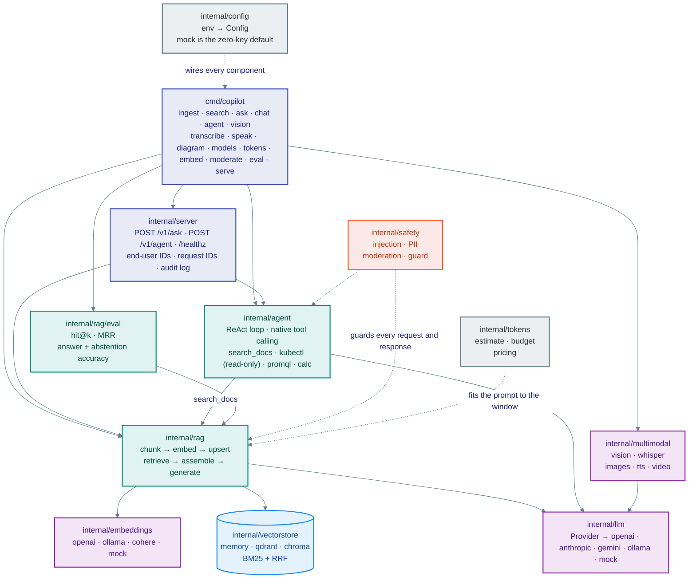
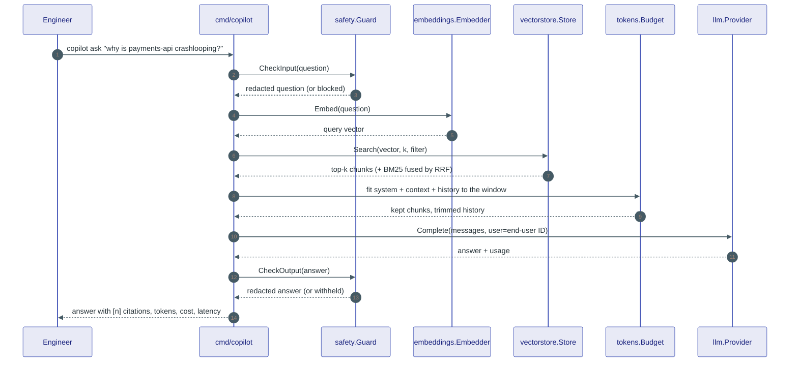

# Architecture

`platform-copilot` is a knowledge copilot for platform / SRE teams. It ingests runbooks, Kubernetes manifests, Terraform, and incident postmortems, answers questions with citations (RAG), runs tool-using agents that can look at a cluster read-only, and understands dashboard screenshots. Every component maps to a section of the **AI Engineer** roadmap — the repo is the roadmap, built.

## Package contract

| Package | Responsibility | Key types / functions | Roadmap section |
|---|---|---|---|
| `cmd/copilot` | CLI entry point; one subcommand per capability | `main.go` | all |
| `internal/config` | Environment-driven configuration; `COPILOT_PROVIDER=mock` is the zero-key default | `Load() Config` | Development Tools |
| `internal/llm` | One `Provider` interface over every chat model | `Provider`, `Request`, `Response`, `Message`, `Tool`, `ToolCall`, `Usage`; `New(cfg)`; `openai.go`, `anthropic.go`, `gemini.go`, `ollama.go`, `mock.go` | Pre-trained Models, OpenAI Platform, Open-Source AI |
| `internal/embeddings` | One `Embedder` interface; cosine/dot/euclidean | `Embedder`, `Cosine`, `openai.go`, `ollama.go`, `mock.go` (deterministic hashed bag-of-words so the mock still ranks semantically-ish) | Embeddings |
| `internal/vectorstore` | `Store` interface; in-memory brute-force with JSON persistence; Qdrant and Chroma HTTP adapters; BM25 + reciprocal-rank fusion for hybrid search | `Store`, `Document`, `Hit`, `Memory`, `Qdrant`, `Chroma`, `BM25`, `RRF` | Vector Databases |
| `internal/rag` | Chunkers (fixed, recursive, markdown-aware), ingestion walker, retriever with threshold, citation-aware prompt assembly, pipeline | `Chunker`, `Ingest`, `Retriever`, `BuildPrompt`, `Pipeline.Ask` | RAG & Implementation |
| `internal/tokens` | Token estimation, context-window budgeting, per-model pricing | `Estimate`, `Budget.Fit`, `Price`, `Cost` | OpenAI API (tokens, pricing) |
| `internal/agent` | ReAct loop (text protocol) and native tool-calling loop; tool registry; read-only cluster tools | `Agent.Run`, `Tool`, `Registry`, `SearchDocs`, `KubectlGet`, `PromQL`, `Calc` | AI Agents |
| `internal/safety` | Prompt-injection heuristics, PII redaction, moderation (OpenAI API + local fallback), input/output constraints, JSON-schema output guard | `DetectInjection`, `RedactPII`, `Moderate`, `Guard` | AI Safety & Ethics |
| `internal/multimodal` | Image → vision request, Whisper transcription, image generation, TTS | `ImagePart`, `Transcribe`, `GenerateImage`, `Speak` | Multimodal AI |
| `internal/server` | HTTP API (`/v1/ask`, `/v1/agent`, `/healthz`) with end-user IDs passed through to providers | `New(deps).ListenAndServe` | Safety (end-user IDs), Dev Tools |
| `labs/python` | Hugging Face Inference, sentence-transformers, LangChain and LlamaIndex RAG, fine-tuning job script | `*.py` | Open-Source AI, RAG, Fine-tuning |
| `labs/js` | Transformers.js in-browser embeddings | `index.html` | Open-Source AI |
| `modules/` | The course: one module per roadmap section, one concept card per node | `00-…` to `09-…` | all |
| `adr/` | Architecture Decision Records for the big forks | `ADR-000x-*.md` | all |

## Request flow — `copilot ask "why is the payments pod CrashLooping?"`

The same flow in words, with what each step actually calls:

1. `safety.DetectInjection` + `safety.RedactPII` screen the question.
2. `embeddings.Embedder.Embed` turns the question into a vector (mock: hashed bag-of-words; real: `text-embedding-3-small`, `nomic-embed-text`, …).
3. `vectorstore.Store.Search` returns the top-k chunks; when hybrid search is on, BM25 hits are fused with RRF.
4. `rag.BuildPrompt` assembles system + context (numbered `[1]`, `[2]` citations) + question, trimmed by `tokens.Budget` to the model's context window.
5. `llm.Provider.Complete` calls the configured model with the request's `User` (end-user ID) attached.
6. `safety.Guard` checks the output (length, banned patterns, optional JSON schema) and the CLI prints the answer with its sources and the estimated cost.

## Configuration

| Variable | Default | Meaning |
|---|---|---|
| `COPILOT_PROVIDER` | `mock` | `mock` · `openai` · `anthropic` · `gemini` · `ollama` |
| `COPILOT_MODEL` | provider default | chat model id |
| `COPILOT_EMBED_PROVIDER` | `mock` | `mock` · `openai` · `ollama` |
| `COPILOT_EMBED_MODEL` | provider default | embedding model id |
| `COPILOT_VECTORSTORE` | `memory` | `memory` · `qdrant` · `chroma` |
| `COPILOT_INDEX_PATH` | `.copilot/index.json` | persistence for the in-memory store |
| `COPILOT_HYBRID` | `true` | fuse BM25 with vector search |
| `OPENAI_API_KEY` / `ANTHROPIC_API_KEY` / `GEMINI_API_KEY` | — | provider keys |
| `OLLAMA_HOST` | `http://localhost:11434` | local models |
| `QDRANT_URL` / `CHROMA_URL` | `http://localhost:6333` / `http://localhost:8000` | external stores |
