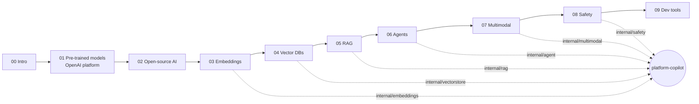

# platform-copilot

> The AI Engineer roadmap, built — not summarised. Every one of its 127 concepts becomes a concept card (what it is, the alternatives compared, why it wins and when it doesn't, the problem it solves and the value it adds) **and** a working piece of one product: a knowledge copilot for platform/SRE teams, written in Go, that answers questions about your runbooks with citations, investigates a cluster with read-only tools, and reads your dashboards.

[](https://github.com/udaykishore-resu/platform-copilot/actions/workflows/ci.yml)
[](go.mod)
[](go.mod)
[](modules/ROADMAP-NODES.md)
[](LICENSE)

```
$ make run                       # clean clone, no API keys: the mock provider runs everything offline

== copilot ask
**Remediation (do both, in this order):** [1].
Raise the memory limit to **1.5Gi** so the pods stop dying while you fix config: [2].
-c payments-api --limits=memory=1.5Gi --requests=memory=1Gi [2].

Sources:
  [1] runbook-payments-api-crashloop.md › Branch A: Reason is `OOMKilled` (exit code 137)  (score 0.033)
  [2] runbook-payments-api-crashloop.md › Branch A: Reason is `OOMKilled` (exit code 137)  (score 0.032)
model=mock/mock-1 tokens=1234+50 cost=$0 (local/mock) latency=3ms

== copilot agent
step 1  search_docs({"k":4,"query":"Why is the payments-api pod crashlooping ..."})
step 2  kubectl_get({"namespace":"payments","resource":"pods"})
From the runbooks: Raise the memory limit to 1.5Gi ... roll back the ConfigMap to v41 [1]
Live observations:
  payments-api-7c9f8d6b5-2xk9p   0/1   CrashLoopBackOff   7 (42s ago)
Recommended next step: follow the runbook remediation above ... I did not change anything.
```

Swap `COPILOT_PROVIDER=ollama` (local, free), `openai`, `anthropic` or `gemini` and the same commands run against a real model.

## Why this repo exists

Most "AI engineer roadmap" repositories are reading lists. This one is a complete AI Engineer curriculum — from pre-trained models and the OpenAI platform through embeddings, vector databases, RAG, agents, multimodal, safety and tooling — and it takes the opposite bet: **you understand a concept when you have built it, measured it, and decided against its alternatives.** So the roadmap is organised as a course where every module ends with a runnable lab, every lab grows the same product, and every non-obvious choice is written down as an Architecture Decision Record. A hiring manager can read the concept cards to see breadth, run `make run` to see it work, read the ADRs to see judgement, and read `make eval` output to see that "works" is measured.

It is deliberately built by a platform engineer for platform engineers: the capstone's corpus is runbooks, Kubernetes manifests, Terraform and postmortems; its agent tools are `kubectl get/describe/logs` (read-only, allowlisted in code) and PromQL; its safety layer knows that `10.42.3.17` is not PII but `kubectl delete ns` in an answer is a bug.

## The course

| # | Module | Roadmap section | Capstone step | Lab |
|---|---|---|---|---|
| 00 | [Introduction](modules/00-introduction/README.md) | What is an AI Engineer, AI vs ML Engineer, LLMs, inference, training, embeddings, vector DBs, RAG, agents, prompt engineering, terminology | Read the architecture; run `copilot models` | `copilot tokens`, `copilot embed` |
| 01 | [Pre-trained Models & the OpenAI Platform](modules/01-pretrained-models-and-openai-platform/README.md) | Pre-trained models, OpenAI/Claude/Gemini/Azure/SageMaker/HF/Mistral/Cohere/Replicate, context length, cut-offs, Chat Completions, tokens, pricing, Playground, fine-tuning | `internal/llm` — one `Provider` over five backends | `labs/python/01_*` — compare providers, count tokens, submit a fine-tune |
| 02 | [Open-Source AI](modules/02-open-source-ai/README.md) | Open vs closed, popular OSS models, Hugging Face Hub/Tasks/Inference SDK, Transformers.js, Ollama | `internal/llm/ollama.go`, `internal/embeddings/ollama.go` | `labs/python/02_*`, `labs/js/transformers-js` |
| 03 | [Embeddings](modules/03-embeddings/README.md) | What embeddings are, OpenAI & open-source embedding models, pricing, semantic search, classification, recommendation, anomaly detection | `internal/embeddings` — cosine, centroid, hashing mock | `labs/python/03_*` |
| 04 | [Vector Databases](modules/04-vector-databases/README.md) | Purpose, Chroma/Pinecone/Weaviate/FAISS/LanceDB/Qdrant/Supabase/MongoDB Atlas, indexing, similarity search | `internal/vectorstore` — exact in-memory store, Qdrant & Chroma adapters, BM25 + RRF | `labs/python/04_vector_db_compare.py` |
| 05 | [RAG & Implementation](modules/05-rag/README.md) | Use cases, RAG vs fine-tuning, chunking → embedding → store → retrieval → generation, raw SDK vs LangChain vs LlamaIndex, Assistants API as the alternative | `internal/rag` — chunkers, ingester, hybrid retriever, citation prompt, eval harness | `labs/python/05_*` — the same RAG four ways |
| 06 | [AI Agents](modules/06-ai-agents/README.md) | Use cases, agent prompting, ReAct, manual loop, OpenAI functions/tools, Assistants API | `internal/agent` — ReAct and native loops, read-only kubectl/PromQL/docs/calc tools | `labs/python/06_*` |
| 07 | [Multimodal AI](modules/07-multimodal-ai/README.md) | Image/video/audio understanding, generation, TTS/STT, Vision, DALL-E, Whisper, HF multimodal, LangChain/LlamaIndex multimodal | `internal/multimodal` — dashboard reading (structured), Whisper, TTS, images | `labs/python/07_*` |
| 08 | [AI Safety & Ethics](modules/08-ai-safety-and-ethics/README.md) | Prompt injection, privacy, bias, Moderation API, end-user IDs, adversarial testing, robust prompting, constraining I/O, best practices | `internal/safety` + `internal/server` — guard, redaction, moderation, audit log | `labs/python/08_*`, `make adversarial` |
| 09 | [Development Tools](modules/09-development-tools/README.md) | AI code editors, code completion tools, agentic CLIs, evaluation, CI for LLM apps | `Makefile`, `.github/workflows/ci.yml`, `data/eval/golden.jsonl` | `make check` |

Every module follows the same [template](modules/TEMPLATE.md); [`modules/ROADMAP-NODES.md`](modules/ROADMAP-NODES.md) maps all 127 nodes and `make docs-check` fails CI if any node loses its card.



## The capstone

```
copilot ask "why is payments-api crashlooping?"
   │
   ├─ safety.Guard          injection heuristics · secret/PII redaction · size limits
   ├─ embeddings.Embedder   openai | ollama | cohere | mock  (one interface)
   ├─ vectorstore.Store     memory (exact, JSON-persisted) | qdrant | chroma
   │     └─ BM25 + RRF      hybrid retrieval: dense for paraphrase, sparse for "PLAT-1901"
   ├─ rag.BuildPrompt       numbered [n] context, token-budgeted, history-trimmed
   ├─ llm.Provider          openai | anthropic | gemini | ollama | mock  (+ retry/backoff)
   └─ safety.Guard          banned destructive commands · output redaction

copilot agent "…"        ReAct (any model) or native tool calling; tools are read-only by construction
copilot vision dash.png  structured DashboardReading via JSON schema
copilot serve            POST /v1/ask · POST /v1/agent · end-user IDs · request IDs · audit log
copilot eval             hit@k · MRR · answer accuracy · abstention accuracy — gated in CI
```

Full package contract, request flow and configuration: [ARCHITECTURE.md](ARCHITECTURE.md). `go.mod` has **zero third-party dependencies** — every provider, store and tool is a small `net/http` client you can read in one sitting ([ADR-0009](adr/ADR-0009-raw-http-clients-over-vendor-sdks.md)).

### Quick start

```bash
git clone https://github.com/udaykishore-resu/platform-copilot && cd platform-copilot
make run                                  # offline demo: ingest → ask → search → agent → moderate
make chat                                 # multi-turn
make eval                                 # RAG metrics against data/eval/golden.jsonl
make test lint adversarial                # what CI runs

# a real model, still free: Ollama
docker compose up -d ollama && docker exec ollama ollama pull llama3.2 && docker exec ollama ollama pull nomic-embed-text
COPILOT_PROVIDER=ollama COPILOT_EMBED_PROVIDER=ollama make run

# a hosted model
export OPENAI_API_KEY=sk-...   # or ANTHROPIC_API_KEY / GEMINI_API_KEY
COPILOT_PROVIDER=openai COPILOT_EMBED_PROVIDER=openai make run
COPILOT_PROVIDER=anthropic bin/copilot vision grafana.png --json

# point it at your own docs
bin/copilot ingest ~/runbooks && bin/copilot ask "how do we rotate the ingress cert?"
```

Requires Go 1.22+. Python labs: `make labs-setup` (or `pip install -r labs/python/requirements.txt`). Course site: `make docs` (MkDocs Material).

### Decisions

Ten [Architecture Decision Records](adr/README.md) cover the forks the roadmap leaves open: provider-agnostic interface, Go for the product and Python for the ecosystem labs, RAG over fine-tuning for operational knowledge, exact search first and Qdrant at scale, hybrid retrieval, ReAct plus native tools, read-only tools with allowlists in code, safety before and after the model, raw HTTP over SDKs, end-user IDs and audit logging.

## Repository layout

```
modules/      the course — one folder per roadmap section, one concept card per node
adr/          architecture decision records
cmd/copilot   CLI (ingest · search · ask · chat · agent · vision · transcribe · speak · diagram · models · tokens · embed · moderate · eval · serve)
internal/     llm · embeddings · vectorstore · rag (+eval) · agent · safety · multimodal · tokens · server · config
labs/python   Hugging Face, sentence-transformers, LangChain, LlamaIndex, OpenAI Assistants, fine-tuning, vision/Whisper/TTS, moderation
labs/js       Transformers.js in the browser
data/         sample knowledge base (runbooks, manifests, Terraform, postmortem, policy) and the golden eval set
```

## Relationship to `ai-engineering-mastery`

[`ai-engineering-mastery`](https://github.com/udaykishore-resu/ai-engineering-mastery) is the theory: 15 topics at 26-section depth (internals, history, scaling, Staff-level discussion). This repository is the practice: the AI Engineer roadmap, concept by concept, as one shippable system. Read that one to understand *how* a transformer or an HNSW index works; use this one to *build and evaluate* a product on top of them.

## Skills demonstrated

Go systems design (clean interfaces, zero-dependency HTTP clients, context/timeouts, race-tested concurrency) · LLM integration across OpenAI, Anthropic, Gemini and Ollama wire formats · embeddings and vector search (cosine, brute-force kNN, HNSW parameters, Qdrant/Chroma APIs) · hybrid retrieval (BM25, reciprocal-rank fusion) · RAG engineering (heading-aware chunking, token budgeting, citation prompting, abstention) · agent design (ReAct, native tool calling, tool registries, allowlisted read-only Kubernetes/Prometheus tools) · multimodal (vision with JSON-schema outputs, Whisper, TTS) · AI safety (prompt-injection heuristics, secret/PII redaction, moderation, output constraints, adversarial regression suite) · LLM evaluation (golden sets, hit@k, MRR, abstention accuracy, CI gates) · Python AI ecosystem (Hugging Face, sentence-transformers, LangChain, LlamaIndex, Assistants API, fine-tuning) · platform engineering context (Kubernetes, EKS, Terraform, on-call practice).

## GitHub metadata

**Description:** The AI Engineer roadmap, built: 127 concept cards + a Go platform/SRE knowledge copilot (RAG, agents, multimodal, safety, eval) with zero dependencies.

**Topics:** `ai-engineering` `llm` `rag` `ai-agents` `golang` `embeddings` `vector-database` `qdrant` `openai` `anthropic` `gemini` `ollama` `langchain` `llamaindex` `huggingface` `prompt-engineering` `ai-safety` `kubernetes` `sre` `platform-engineering` `roadmap` `course`

## License

[MIT](LICENSE) © 2026 Udaykishore Resu
