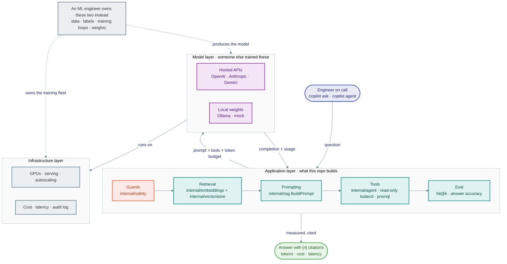

# Module 00 · Introduction

> **Roadmap nodes covered:** What is an AI Engineer?, AI Engineer vs ML Engineer, Roles and Responsibilities, Impact on Product Development, AI vs AGI, LLMs, Inference, Training, Embeddings, Vector Databases, RAG, AI Agents, Prompt Engineering, Common Terminology, Pre-requisites (Frontend / Backend / Full-Stack)
>
> **Capstone step:** Clone the repo, build `cmd/copilot`, run `ingest` and `ask` end to end against the `mock` provider (`internal/llm/mock.go`, `internal/embeddings/mock.go`, `internal/vectorstore` in-memory store). Nothing is configured beyond `COPILOT_PROVIDER=mock`; the point is to see every box in the architecture diagram light up once before any of them is studied in depth.
>
> **Time:** ~3 hours · **Prerequisites:** none (comfortable with Go, a terminal, and Kubernetes vocabulary)

## Why this module exists

A platform engineer who has spent a decade on Kubernetes, Terraform and on-call rotations already knows what a knowledge problem looks like: the runbook that is two releases stale, the postmortem nobody re-reads, the PromQL query that lives in one person's shell history. What that engineer typically cannot do yet is reason about a system where one of the components is a probabilistic text model. The vocabulary is unfamiliar (tokens, embeddings, context window, temperature), the failure modes are unfamiliar (a confident wrong answer instead of a stack trace), and the cost model is unfamiliar (you are billed per token, not per CPU-second). This module builds the vocabulary and the mental model so that the following nine modules read as engineering, not magic.

The capstone, `platform-copilot`, is the running example throughout the course. It ingests runbooks, Kubernetes manifests, Terraform modules and incident postmortems; answers questions with citations (retrieval-augmented generation); runs a tool-using agent that can inspect a cluster read-only through `kubectl get` and PromQL; and reads dashboard screenshots. Every node on the AI Engineer roadmap maps to a package in this repository. After this module you will have run the whole pipeline once with a deterministic mock model, so that when Module 01 introduces real providers you already know exactly which interface they plug into.

The module also sets the standard of judgment the rest of the course holds itself to. Each concept card compares the thing being taught with its real alternatives and names the conditions under which the alternative is the better choice. An AI engineer who cannot say "we should not use an LLM here" is not yet an engineer.



*The layers an AI engineer works at, and the two an ML engineer owns instead.*

## Concept cards

### What is an AI Engineer?

**What it is.** An AI engineer builds products on top of pre-trained foundation models rather than training models from scratch. The job is integration and systems work: choosing a model, shaping its inputs (prompts, retrieved context, tool results), validating its outputs, and wrapping the whole thing in the reliability, observability, cost control and security that any production service needs. The core skill is treating a non-deterministic component as an engineering dependency with a contract, an SLO and a budget.

**Alternatives compared.**

| Option | Strengths | Weaknesses | Choose it when |
|---|---|---|---|
| AI engineer (application layer) | Ships user-facing value in weeks; reuses frontier models; needs no GPU fleet or labelled data | Dependent on vendors' model behaviour and pricing; limited control over model internals | The problem is "use intelligence" rather than "create intelligence" |
| ML engineer (model layer) | Full control over the model; can optimise for a narrow, well-specified task; owns the data pipeline | Long iteration cycles; needs labelled data and compute; a narrow model does one thing | A closed-form task with abundant data where a small specialised model beats a general one on cost or latency |
| Backend engineer calling an API without AI skills | Fast start | Ships prompt-injection holes, unbounded cost, unmeasured accuracy; cannot debug a bad answer | Never for anything users depend on; acceptable for a throwaway prototype |

**Why it wins (and when it doesn't).** For most product problems the marginal gain from training your own model is small compared with the gain from better retrieval, better prompts and better evaluation, so the application layer is where the leverage is. It stops being true when the task is narrow and high-volume (classify ten million log lines a day), when data cannot leave the building, or when latency must be single-digit milliseconds; there an ML engineer's small fine-tuned or classical model wins.

**Problem it solves → value added.** Without an AI engineer, `platform-copilot` is a shell script that pipes a question to an API and prints whatever comes back. The failure mode is quiet: plausible but wrong remediation steps for a CrashLooping pod. With the discipline this course teaches, answers carry citations to the runbook chunk they came from, every call has a token budget and a cost estimate, inputs are screened for injection, and accuracy is measured on a fixed question set before each release.

**In the capstone.** The whole repository; start with `ARCHITECTURE.md` and the request flow for `copilot ask`.

### AI Engineer vs ML Engineer

**What it is.** The two roles split along the model boundary. An ML engineer produces models: data collection and labelling, feature engineering, training loops, hyper-parameter search, model evaluation, serving infrastructure. An AI engineer consumes models: prompt and context design, retrieval, tool use, orchestration, evaluation of end-to-end task success, and the product surface. The ML engineer's unit of work is a training run; the AI engineer's unit of work is a request.

**Alternatives compared.**

| Option | Strengths | Weaknesses | Choose it when |
|---|---|---|---|
| AI engineer | Fast iteration on product behaviour; frontier capability for free; skills transfer across vendors | Cannot fix a model's intrinsic weakness; costs scale with tokens | Building products on foundation models |
| ML engineer | Can produce a model that is smaller, faster, cheaper and private for one task | Months to first result; needs labelled data; model decays as data drifts | Narrow tasks at very high volume, or regulated data |
| Hybrid team (both) | AI engineer ships with a frontier model, ML engineer distils a small model once traffic and labels exist | Coordination cost; two skill sets to hire | A product that starts broad and later needs a cheap hot path |

**Why it wins (and when it doesn't).** Distinguishing the roles matters because hiring, tooling and evaluation are different. An AI engineer evaluates with task-level tests (did the copilot cite the right runbook section) while an ML engineer evaluates with loss curves and held-out metrics. The distinction blurs at fine-tuning, which Module 01 treats as an AI-engineer tool because the vendor runs the training loop. It blurs again when an AI product needs a custom embedding model, which is ML work.

**Problem it solves → value added.** Teams that staff an LLM product with only ML engineers tend to over-invest in training and under-invest in retrieval and evaluation; teams with only backend engineers tend to ship unmeasured prompts. Knowing which hat you are wearing keeps `platform-copilot` focused: it fine-tunes nothing in the first eight modules and gets its accuracy from retrieval quality and prompt structure, which is where the measurable gain is.

**In the capstone.** Conceptual. The split is visible in the repo layout: everything in `internal/` is AI-engineering; the only model-training artefact is the fine-tuning lab in `labs/python/01_finetune_job.py`, which delegates training to the vendor.

### Roles and Responsibilities

**What it is.** An AI engineer owns five things: model selection and the provider abstraction; the data path from raw documents to model context (chunking, embedding, retrieval); the prompt and tool contracts; evaluation and observability of answer quality, latency and cost; and safety (injection, PII, moderation, output constraints). In a platform team these responsibilities sit next to the SRE's usual ownership of reliability and cost, which is why SREs convert well into the role.

**Alternatives compared.**

| Option | Strengths | Weaknesses | Choose it when |
|---|---|---|---|
| One AI engineer owning the full stack | Coherent design; fast decisions | Single point of failure; breadth over depth | Small teams and early products |
| Split: "prompt engineer" plus backend engineer | Specialisation on prompt wording | Prompts divorced from retrieval and evaluation drift quickly; prompt-only roles rarely survive contact with production | Rarely; prompt design is a skill inside the role, not a role |
| Platform team exposes an internal LLM gateway; product teams consume it | Central cost, safety and model governance | Product teams still need AI-engineering judgment to use it well | Any organisation with more than a couple of LLM-backed products |

**Why it wins (and when it doesn't).** Keeping evaluation and safety inside the same role as prompt and retrieval design is what makes the system improvable: when accuracy drops you can see whether retrieval or generation caused it. Splitting the role is justified once there is enough traffic to need a dedicated evaluation or safety function.

**Problem it solves → value added.** In the capstone each responsibility is a package: `internal/llm` (model selection), `internal/rag` and `internal/embeddings` (data path), `internal/agent` (tool contracts), `internal/tokens` (cost), `internal/safety` (safety). An engineer who owns all five can answer "why did the copilot give a wrong answer about the Terraform state lock?" by tracing the request through them instead of guessing.

**In the capstone.** The package table in `ARCHITECTURE.md`.

### Impact on Product Development

**What it is.** Foundation models change the product development loop in three ways. Prototyping collapses from weeks to hours because a prompt replaces a first implementation. The definition of "done" becomes statistical: a feature works on 94 percent of a test set rather than passing or failing. And operating cost becomes variable per request and visible per feature, which pulls finance into design reviews. Product teams that do not adapt their process (evals instead of unit tests alone, cost budgets per feature, graceful degradation for model failures) ship demos that do not survive production.

**Alternatives compared.**

| Option | Strengths | Weaknesses | Choose it when |
|---|---|---|---|
| LLM-backed feature | Handles unstructured input and open-ended tasks; fast to prototype | Non-deterministic; per-request cost; latency of seconds; needs evals | The input is natural language or unstructured documents |
| Deterministic code | Exact, testable, cheap, fast | Cannot handle language or fuzzy matching without enormous rule sets | The input is structured and the rules are known |
| Classical ML (classifier, regression) | Cheap, fast, measurable | Needs labelled data; fixed label set | Narrow, high-volume decisions with training data |

**Why it wins (and when it doesn't).** Use the model for the part of the problem that is actually about language and keep everything else deterministic. In the capstone the model writes the explanation; `kubectl` and PromQL fetch the facts; Go code enforces that the agent's tools are read-only. Pushing deterministic work into the model (asking it to do arithmetic, to parse YAML, to remember a value) is the most common design error in LLM products.

**Problem it solves → value added.** Without this discipline, a team might ask the copilot to "check if the deployment is healthy" and have the model guess. With it, the `kubectl_get` tool returns the real status and the model only explains it. The measurable value is in the evaluation set: accuracy on factual questions jumps when facts come from tools rather than from the model's memory.

**In the capstone.** `internal/agent` (deterministic tools, probabilistic planner); the evaluation harness described in Module 09.

### AI vs AGI

**What it is.** "AI" in this course means narrow systems, including large language models, that perform tasks within the distribution of their training data and their context. "AGI" refers to a hypothetical system with human-level general competence across domains, including the ability to learn new tasks without retraining. Current LLMs are not AGI: they have no persistent memory beyond the context window, no grounding in the world except through tools you give them, and performance that degrades on inputs unlike their training data. Engineering decisions must be made about the system that exists.

**Alternatives compared.**

| Option | Strengths | Weaknesses | Choose it when |
|---|---|---|---|
| Treat the model as a capable but fallible component (the correct stance) | Leads to verification, citations, tool grounding, guardrails | Requires more engineering | Always, in production |
| Treat the model as an oracle | Less code | Confident wrong answers reach users; no way to detect regression | Never |
| Treat the model as useless noise | No risk | Forfeits real value on summarisation, search and explanation | Only when the task has zero tolerance for error and no verification path |

**Why it wins (and when it doesn't).** The fallible-component stance is what justifies every safety and evaluation decision in the capstone. It is also the honest answer to a hiring manager who asks whether the copilot can run `kubectl delete`: it cannot, by construction, because we do not trust a narrow model with irreversible actions.

**Problem it solves → value added.** An on-call engineer at 3 a.m. who takes a model's remediation advice at face value can make an incident worse. The copilot mitigates this with citations (the reader can check the runbook), read-only tools (the model cannot act), and a visible confidence signal (retrieval score threshold in `internal/rag`).

**In the capstone.** Conceptual; the design consequence is `internal/agent` exposing only read-only `Kubectl` tools (`kubectl_get`/`kubectl_describe`/`kubectl_logs`) and `PromQL` and `internal/rag.Retriever` returning "I don't know" below a similarity threshold.

### LLMs

**What it is.** A large language model is a transformer neural network trained to predict the next token over a very large text corpus, then further trained (instruction tuning, reinforcement learning from human or AI feedback) to follow instructions and converse. Inference is autoregressive: the model emits one token at a time, each conditioned on the prompt and all previously generated tokens. The model has a fixed context window (on the order of 128k to 1M tokens for current frontier models), no memory between requests, and its knowledge ends at a training cut-off date.

**Alternatives compared.**

| Option | Strengths | Weaknesses | Choose it when |
|---|---|---|---|
| Frontier hosted LLM (OpenAI, Anthropic, Google) | Best reasoning, tool use, long context; no infra | Per-token cost; data leaves the network; vendor dependency | Quality matters and data policy permits |
| Open-weights LLM self-hosted (Llama, Mistral, Qwen, Gemma) | Data stays local; fixed cost; full control | Needs GPUs; smaller models reason worse; you own the ops | Regulated data, air-gapped clusters, very high volume |
| Small task-specific model or rules | Microsecond latency; near-zero cost | Cannot generalise; no language understanding | The task is a classifier or a lookup |

**Why it wins (and when it doesn't).** An LLM is the right tool when the input is language and the output is language or a decision that depends on reading. It is the wrong tool for arithmetic, for anything that must be exact, and for anything where the cost of a confident error is high and unverifiable.

**Problem it solves → value added.** Before LLMs, a runbook search was keyword search: "CrashLoopBackOff" finds documents containing that string. An LLM given the right three runbook chunks can explain which of them applies to this pod and why, in the engineer's own words, and translate between "the payments pod keeps restarting" and the runbook's "container exits with code 137". The value is time-to-first-useful-answer during an incident.

**In the capstone.** `internal/llm` — the `Provider` interface with `Request`, `Response`, `Message`, `Usage`; implementations in `openai.go`, `anthropic.go`, `gemini.go`, `ollama.go`, `mock.go`; `copilot chat`.

### Inference

**What it is.** Inference is running a trained model forward to produce output. For an LLM it is the autoregressive decode loop: a prefill pass over the prompt (compute-bound, cost proportional to prompt length), then one decode step per output token (memory-bandwidth-bound, cost proportional to output length). Latency therefore has two components, time to first token and tokens per second, and both are what you pay for: input tokens and output tokens are priced separately, with output typically several times more expensive. Sampling parameters (temperature, top-p) control how the next token is chosen from the model's distribution.

**Alternatives compared.**

| Option | Strengths | Weaknesses | Choose it when |
|---|---|---|---|
| Hosted inference API | Zero ops; scales elastically; newest models | Per-token price; network egress; rate limits | Default |
| Self-hosted inference server (vLLM, Ollama, TGI) | Fixed cost at high utilisation; private | Must size GPUs for peak; you handle batching, KV cache, upgrades | Sustained high volume or data residency |
| Batch / asynchronous inference | Often half the per-token price; no latency pressure | Results in hours, not seconds | Offline jobs: summarise last quarter's postmortems |

**Why it wins (and when it doesn't).** Hosted synchronous inference is correct for an interactive copilot. Batch inference is correct for the ingest-time enrichment (generating a summary per runbook). Self-hosting wins once utilisation is high enough that a GPU is busy most of the day, or when the data cannot leave.

**Problem it solves → value added.** Understanding prefill versus decode explains two capstone design choices: retrieval trims context to only the relevant chunks (shorter prefill, lower input cost) and answers are asked to be concise with a `MaxTokens` cap (bounded decode, bounded latency). Streaming the response makes the perceived latency the time to first token rather than the full decode.

**In the capstone.** `internal/llm.Request` carries `MaxTokens` and `Temperature`; `internal/llm.Usage` records prompt and completion tokens; `internal/tokens.Cost` prices them; `copilot chat` prints the cost line after every turn (responses are not streamed).

### Training

**What it is.** Training is the process that produces model weights: pre-training on a large corpus (next-token prediction at enormous scale, the expensive part), followed by post-training (supervised fine-tuning on instruction data, then preference optimisation such as RLHF or DPO). Fine-tuning, which an AI engineer may do, is a small additional training run on a pre-trained model with a few hundred to a few thousand examples to change style, format or narrow behaviour. Training changes what the model knows and how it behaves; it does not give the model access to data it has not seen.

**Alternatives compared.**

| Option | Strengths | Weaknesses | Choose it when |
|---|---|---|---|
| Use a pre-trained model as-is (prompting) | Zero training cost; instant iteration | Limited by prompt length and model's prior behaviour | Default |
| Retrieval (RAG) | Fresh, private, citable knowledge; no training | Adds latency and a retrieval system to operate | Knowledge changes or is proprietary |
| Fine-tuning | Consistent format and style; shorter prompts; can teach a smaller model a task | Costs money and time per iteration; knowledge goes stale; needs curated data | Style/format tasks at volume, or distilling a big model into a small one |
| Pre-training your own model | Total control | Tens of millions of dollars and a research team | Effectively never, for an application team |

**Why it wins (and when it doesn't).** For the capstone, retrieval beats fine-tuning for knowledge because runbooks change weekly and a fine-tuned model cannot cite a source. Fine-tuning earns its place later for output format (always emit a structured incident summary in the team's template) where consistency matters more than knowledge.

**Problem it solves → value added.** Teams that fine-tune to "teach the model our runbooks" discover that the model hallucinates runbook steps confidently and cannot be updated without a new training run. Choosing retrieval instead gives verifiable, updatable answers with `copilot ingest` as the only refresh step.

**In the capstone.** Conceptual until Module 01's fine-tuning card; `labs/python/01_finetune_job.py` builds a JSONL dataset and submits a vendor fine-tuning job.

### Embeddings

**What it is.** An embedding is a dense fixed-length vector (typically 256 to 3072 dimensions) produced by a model trained so that semantically similar inputs map to nearby points. Similarity is measured with cosine similarity or dot product. Embedding models are separate from chat models, far cheaper per token, and deterministic for a given model version. They turn "find documents that mean the same thing as this question" into a nearest-neighbour search.

**Alternatives compared.**

| Option | Strengths | Weaknesses | Choose it when |
|---|---|---|---|
| Dense embeddings | Captures meaning and paraphrase; language-agnostic | Weak on exact identifiers (pod names, error codes); needs a vector index | Semantic search over prose |
| Lexical search (BM25) | Exact on identifiers and rare terms; no model needed; explainable | Misses synonyms and paraphrase | Logs, IDs, code symbols |
| Hybrid (dense + BM25 with rank fusion) | Best of both on mixed corpora | Two indexes to maintain | Runbooks that mix prose with `kubectl` commands and error strings |

**Why it wins (and when it doesn't).** On a corpus of runbooks and manifests, dense embeddings alone miss queries like "what does exit code 137 mean" when the runbook says "OOMKilled"; BM25 alone misses "pod keeps dying" versus "CrashLoopBackOff". The capstone defaults to hybrid for this reason (`COPILOT_HYBRID=true`).

**Problem it solves → value added.** Embeddings make retrieval recall measurable and improvable: when the copilot fails to find the right runbook, you can inspect the similarity scores, adjust chunking, or switch embedding model, none of which require touching the chat model.

**In the capstone.** `internal/embeddings` — `Embedder` interface, `Cosine`, `openai.go`, `ollama.go`, `mock.go`; `copilot embed`.

### Vector Databases

**What it is.** A vector database stores embeddings alongside their source text and metadata and answers k-nearest-neighbour queries. Small collections (tens of thousands of vectors) can be searched by brute force in memory in milliseconds; larger ones use approximate indexes such as HNSW that trade a little recall for sub-linear search. Production features are metadata filtering (only chunks from the `payments` namespace), persistence, and CRUD on documents so re-ingesting a changed runbook replaces its chunks.

**Alternatives compared.**

| Option | Strengths | Weaknesses | Choose it when |
|---|---|---|---|
| In-memory brute force with JSON persistence | Zero dependencies; exact results; trivial to debug | Linear scan; single process | Up to low hundreds of thousands of vectors, dev and small teams |
| Dedicated vector DB (Qdrant, Chroma, Weaviate, Pinecone) | HNSW indexes; filtering; horizontal scale; managed options | Another service to run or pay for | Millions of vectors or multi-tenant |
| Vector extension in an existing DB (pgvector, Atlas) | One database to operate; transactional with your other data | Index performance below dedicated stores at scale | You already run Postgres or Mongo and the corpus is moderate |

**Why it wins (and when it doesn't).** The capstone starts with the in-memory store because a platform team's runbook corpus is small and a zero-dependency default makes the lab runnable anywhere. Qdrant and Chroma adapters exist behind the same `Store` interface so the swap is a one-line environment change, not a rewrite.

**Problem it solves → value added.** Without a store, every query would re-embed the whole corpus (cost and seconds of latency). With it, ingest is paid once and queries cost one embedding call plus a search.

**In the capstone.** `internal/vectorstore` — `Store`, `Document`, `Hit`, `Memory`, `Qdrant`, `Chroma`, `BM25`, `RRF`; `COPILOT_VECTORSTORE`, `COPILOT_INDEX_PATH`.

### RAG

**What it is.** Retrieval-augmented generation retrieves the most relevant pieces of a private corpus at query time and places them in the model's context before asking it to answer. The pipeline is: chunk documents, embed chunks, store vectors; at query time embed the question, retrieve top-k chunks, assemble a prompt with numbered citations, generate, and check the output. RAG gives the model knowledge it was never trained on, keeps that knowledge current by re-ingesting, and makes answers verifiable because each claim can cite a chunk.

**Alternatives compared.**

| Option | Strengths | Weaknesses | Choose it when |
|---|---|---|---|
| RAG | Fresh, private, citable; updatable without training | Retrieval quality bounds answer quality; more moving parts | Knowledge-heavy tasks over a changing corpus |
| Long-context stuffing (put all docs in the prompt) | Simple; no retrieval errors | Cost scales with corpus per query; quality degrades in very long contexts; corpus must fit | Corpus is small (a few hundred pages) and queries are rare |
| Fine-tuning on the corpus | Short prompts | Cannot cite; stale on every change; hallucinates details | Style and format, not facts |
| Vendor-managed retrieval (file search in an assistants-style API) | Least code | Opaque chunking and ranking; lock-in | Prototypes |

**Why it wins (and when it doesn't).** RAG is the correct architecture for runbooks and postmortems because they change, they are private, and an on-call engineer needs to see the source. Long-context stuffing is a legitimate alternative for a single postmortem review session where the whole document fits and the cost is paid once.

**Problem it solves → value added.** Measured on a fixed question set, a bare chat model answers platform-specific questions ("what is our rollback procedure for the ingress controller?") with generic advice. With RAG the same model cites the team's own runbook section, and the retrieval threshold lets it say "no runbook covers this" instead of inventing one.

**In the capstone.** `internal/rag` — `Chunker`, `Ingester.Ingest`, `Retriever`, `BuildPrompt`, `Pipeline.Ask`; commands `copilot ingest`, `copilot ask`, `copilot search`.

### AI Agents

**What it is.** An agent is an LLM in a loop with tools: the model is shown a goal and a set of tool descriptions, decides which tool to call with which arguments, the host executes the call and returns the result, and the model continues until it produces a final answer. The two common protocols are a text-based ReAct format (Thought / Action / Observation) and native structured tool calling where the provider returns a typed `ToolCall`. The host, not the model, owns execution, permissions and iteration limits.

**Alternatives compared.**

| Option | Strengths | Weaknesses | Choose it when |
|---|---|---|---|
| Agent loop with read-only tools | Grounds answers in live state; can chain steps | More calls, more latency, more cost; needs iteration caps and tool sandboxing | The question needs live data (current pod status, a metric) |
| Single RAG call | Cheap, predictable, one round trip | Only knows what is in the corpus | The answer is in the documents |
| Fixed workflow (code decides the steps, model fills in text) | Deterministic control flow; easy to test | Cannot adapt to unexpected situations | The steps are known in advance |

**Why it wins (and when it doesn't).** An agent is the right tool when the sequence of lookups depends on what is found ("the pod is OOMKilled, so now check its memory limit and the node's pressure"). It is the wrong tool when a fixed workflow would do, because every extra model decision is an opportunity for error and cost. The capstone agent is deliberately read-only; any write action would be a separate, human-approved workflow.

**Problem it solves → value added.** A RAG-only copilot can tell you what the runbook says about CrashLoopBackOff but not whether this pod is in that state. The agent closes that gap by calling `kubectl_get` and `promql` and reasoning over the actual output, which cuts the number of manual lookups an on-call engineer performs during triage.

**In the capstone.** `internal/agent` — `Agent.Run`, `Tool`, `Registry`, `SearchDocs`, `Kubectl.Tools`, `PromQL`, `Calc`; `copilot agent`.

### Prompt Engineering

**What it is.** Prompt engineering is designing the model's input so that its output is reliably correct and well-formed: a system message that fixes role, scope and refusal rules; clear delimitation between instructions, retrieved context and user input; explicit output format (often JSON with a schema); few-shot examples for format; and instructions to cite or to say "I don't know". It is a software artefact, versioned and tested, not a chat trick.

**Alternatives compared.**

| Option | Strengths | Weaknesses | Choose it when |
|---|---|---|---|
| Structured prompt template with tests | Cheap to iterate; portable across models; testable | Can only steer behaviour the model is already capable of | Always, as the first lever |
| Fine-tuning | Bakes format and style in; shorter prompts at volume | Cost and staleness per iteration | When a prompt has plateaued and volume justifies it |
| Constrained decoding / structured output modes | Guarantees syntactically valid JSON | Still does not guarantee semantic correctness | Whenever the output is consumed by code |

**Why it wins (and when it doesn't).** Prompting is the highest-leverage, lowest-cost lever and should be exhausted before fine-tuning. Its limit is that it cannot add knowledge (use retrieval) or reliably add capability the model lacks (use a better model or tools).

**Problem it solves → value added.** An unstructured prompt gives the copilot answers that sometimes cite, sometimes do not, and sometimes follow instructions embedded in a malicious runbook. A structured prompt with clear delimiters, numbered context and a required citation format makes the output parseable, auditable and noticeably more resistant to injection.

**In the capstone.** `internal/rag.BuildPrompt` (system + numbered `[1]`, `[2]` context + question); the ReAct prompt in `internal/agent`; `internal/safety.Guard` for output-format enforcement.

### Common Terminology

**What it is.** The vocabulary used throughout the course, defined once. Token: the unit of text a model reads and is billed on, roughly three-quarters of an English word, so 1,000 tokens is about 750 words. Context window: the maximum tokens (prompt plus output) per request. Temperature: sampling randomness, 0 for near-deterministic output, about 0.7 to 1.0 for creative variety. Top-p: nucleus sampling, restricting choices to the smallest set of tokens whose cumulative probability exceeds p. System / user / assistant messages: the roles in a chat transcript. Hallucination: fluent output that is unsupported by the input or by fact. Grounding: supplying facts in context so the model does not need to recall them. Zero-shot / few-shot: no examples versus a handful of examples in the prompt. Latency terms: time to first token and tokens per second.

**Alternatives compared.**

| Option | Strengths | Weaknesses | Choose it when |
|---|---|---|---|
| Shared glossary enforced in code names and docs | Design reviews are precise; new hires ramp fast | Needs maintenance | Always |
| Vendor-specific terminology per provider | Matches each SDK | Teams confuse "max_tokens" with "context window", "function" with "tool" | Never as the primary vocabulary; map into the shared terms |
| Informal usage | None | Ambiguity causes real bugs (a budget set in characters instead of tokens) | Never |

**Why it wins (and when it doesn't).** The capstone's `internal/llm` types use the neutral vocabulary (`Message`, `Tool`, `ToolCall`, `Usage`, `MaxTokens`) and each provider adapter translates to the vendor's names. That keeps the rest of the codebase vendor-agnostic and keeps conversations precise.

**Problem it solves → value added.** A concrete failure: a token budget computed as `len(text)/4` against a window quoted in tokens works in English and silently overflows on YAML-heavy manifests, where tokens per character are higher. Knowing that "token" is model-specific and that code and config tokenise differently from prose prevents the bug, which `internal/tokens.Estimate` accounts for.

**In the capstone.** Type names in `internal/llm`; `internal/tokens.Estimate` and `Budget`.

### Pre-requisites (Frontend / Backend / Full-Stack)

**What it is.** The roadmap assumes a working software engineer. For this course specifically: fluent Go (interfaces, context, HTTP clients, JSON, testing); comfortable with HTTP APIs, authentication and rate limiting; basic Python for the labs in `labs/python`; enough JavaScript to read a single HTML file for the Transformers.js lab; and the platform vocabulary the capstone is about (Kubernetes objects, Terraform state, Prometheus and PromQL, incident process). No machine-learning background is required; linear algebra appears only as cosine similarity.

**Alternatives compared.**

| Option | Strengths | Weaknesses | Choose it when |
|---|---|---|---|
| Backend engineer (this course's target) | Already thinks in services, budgets, SLOs, security; LLM becomes one more dependency | Must learn probabilistic evaluation | Building production AI systems |
| Frontend engineer | Owns the user-facing surface where streaming, latency and trust are felt | Less exposure to the data path and ops | Building the product surface over an existing AI backend |
| Full-stack | Can ship the whole loop alone | Breadth can mean shallow evaluation discipline | Early-stage products |

**Why it wins (and when it doesn't).** A backend and platform background is the strongest starting point for the capstone because every hard problem in it (cost control, rate limiting, retries, secrets, read-only access, observability) is a backend problem. The gap to close is statistical thinking about correctness, which Module 09's evaluation harness addresses.

**Problem it solves → value added.** Engineers without the HTTP and concurrency fundamentals end up fighting the SDKs; engineers without the platform vocabulary cannot judge whether the copilot's answer about a PodDisruptionBudget is right. Both are required to evaluate the product, and evaluation is the job.

**In the capstone.** Conceptual. The Go toolchain version is pinned in `go.mod`; Python dependencies are pinned in `labs/python/requirements.txt`; the browser lab in `labs/js/transformers-js/index.html` needs no build step.

## Lab

The goal is to run the entire pipeline once with no API keys, then swap in a real provider.

**1. Build the CLI.**

```bash
git clone https://github.com/udaykishoreresu/platform-copilot.git
cd platform-copilot
go build -o bin/copilot ./cmd/copilot
./bin/copilot help
```

Expected: a usage listing grouped by module with the subcommands `ingest`, `search`, `ask`, `chat`, `agent`, `vision`, `transcribe`, `speak`, `diagram`, `models`, `tokens`, `embed`, `moderate`, `eval`, `serve`.

`cmd/copilot` is a single binary with one subcommand per capability; each subcommand maps to one or two packages in `internal/`.

**2. Confirm the zero-key defaults.**

```bash
./bin/copilot models
```

Expected: a price table of known models followed by an `Active:` line showing `provider=mock model=(default) embed=mock/(default) store=memory`.

`internal/config.Load` reads the `COPILOT_*` variables listed in `ARCHITECTURE.md`; with nothing set, every component is the mock or in-memory implementation, so the lab is fully offline.

**3. Ingest the sample corpus.**

```bash
./bin/copilot ingest ./data/knowledge
```

Expected: a line per file (`runbook-payments-api-crashloop.md`, `k8s-payments-deployment.yaml`, `terraform-eks-nodegroup.tf`, `postmortem-2026-03-redis-eviction.md`, and others) with its chunk count, and a final summary like `ingested 6 files → 55 chunks (0 unchanged) with mock/hashing-bow-trigram (256 dims) into memory in 13ms`.

`internal/rag.Ingester.Ingest` walks the directory, picks a chunker by file type (`Chunker.Markdown` for `.md`, `Chunker.Recursive` for YAML and HCL), embeds each chunk with `internal/embeddings.Embedder`, and upserts into `internal/vectorstore.Store`. The mock embedder is a deterministic hashed bag-of-words, so ranking is lexical-ish but stable across runs.

**4. Search without generation.**

```bash
./bin/copilot search "pod keeps restarting with exit code 137"
```

Expected: the top five hits, each as `[n] score  source › heading path` followed by the first ~300 characters of the chunk. The `runbook-payments-api-crashloop.md` runbook should rank near the top; with `COPILOT_HYBRID=true` (default) the BM25 hit on `137` is fused with the vector hits via reciprocal rank fusion.

**5. Ask a question end to end.**

```bash
./bin/copilot ask "why is the payments pod CrashLooping and what is the first thing to check?"
```

Expected: an answer with `[1]`, `[2]` citations, a `Sources:` list mapping each citation to a file and heading path with its score, and a trailer like `model=mock/mock-1 tokens=1279+58 cost=$0 (local/mock) latency=5ms`.

The mock provider echoes a templated answer that quotes the retrieved chunks, which is exactly what you want here: it proves the retrieval and prompt assembly are working before a real model hides any mistakes behind fluent prose.

**6. Inspect the token budget.**

```bash
./bin/copilot tokens ./data/knowledge/runbook-payments-api-crashloop.md
```

Expected: a line like `chars=5710 words=737 estimated_tokens=1723 (±10% prose, ±25% code/YAML)` followed by a per-model table with the cost of that text as input and as output.

**7. With real models.** Set a key and re-run step 5.

```bash
export COPILOT_PROVIDER=openai
export OPENAI_API_KEY=sk-...
./bin/copilot ask "why is the payments pod CrashLooping and what is the first thing to check?"
```

Or run fully local:

```bash
ollama pull llama3.2
ollama pull nomic-embed-text
export COPILOT_PROVIDER=ollama COPILOT_EMBED_PROVIDER=ollama
./bin/copilot ingest ./data/knowledge   # re-embed with the real embedder
./bin/copilot ask "why is the payments pod CrashLooping and what is the first thing to check?"
```

Note that changing `COPILOT_EMBED_PROVIDER` requires re-ingesting: vectors from different embedding models are not comparable, and the in-memory store refuses a query whose vector dimension differs from the index (`dimension mismatch … re-run ingest after changing the embedding model`).

## Production notes

- The mock provider is for tests and labs only. Keep it in the build so CI and `go test ./...` never need a key, but make `COPILOT_PROVIDER=mock` impossible to select in the production deployment (fail closed in `internal/config` when an environment flag marks the build as production).
- Secrets come from the environment or a secret manager, never from flags or files checked in; the CLI must never print a key, even truncated, in `models` output.
- Every request should log provider, model, prompt tokens, completion tokens, estimated cost, retrieval hit count and top similarity score as structured fields. These six numbers are the whole observability story for an LLM app and they are cheap to collect from `Usage` and `Hit`.
- Expect per-request latency of one to several seconds for a frontier model; design the UI for streaming and set client timeouts accordingly (30 to 60 seconds), with retries only on idempotent failures (429, 5xx) and with jittered backoff to respect rate limits.
- The corpus is sensitive: runbooks contain hostnames, postmortems contain names. Module 08 adds PII redaction at ingest; until then, do not point `ingest` at real postmortems in a shared environment.
- Cost is variable and user-driven. Put a per-user and per-day budget in front of `ask` before exposing it to a team; Module 01 introduces the pricing table in `internal/tokens`.

## Check your understanding

1. You are asked to make the copilot "know" the latest runbooks. A colleague proposes fine-tuning on the runbook repository nightly. What do you choose and why?
2. A product manager asks whether the agent can restart a deployment when it detects a CrashLoop. What is your answer and what design principle backs it?
3. The team wants to skip the vector store and put all runbooks into a 1M-token context on every question. Under what conditions is that acceptable, and what breaks when it is not?
4. Retrieval returns the right runbook for "pod keeps dying" but not for "exit code 137". What is the likely cause and the cheapest fix?
5. A budget check computes tokens as `len(text)/4`. Where will that estimate be most wrong in this corpus, and what is the consequence?

<details>
<summary>Answers</summary>

1. Retrieval (RAG). Runbooks change frequently and answers must cite the source. Fine-tuning cannot cite, goes stale between runs, and hallucinates procedural details; re-running `copilot ingest` is the only refresh step RAG needs. Fine-tuning is reserved for output format and style.
2. No, by construction. The model is a fallible narrow component, so it is given only read-only tools (`Kubectl` get/describe/logs, `PromQL`). Any write action belongs in a separate workflow with a human approval step, not inside the agent loop.
3. Acceptable when the corpus is small enough to fit with headroom, queries are infrequent, and the cost per query (the whole corpus as input tokens every time) is tolerable. It breaks on cost at volume, on latency (prefill of a huge prompt), and on quality (models attend less reliably to details in very long contexts). RAG reduces per-query cost to one embedding plus a few chunks.
4. Dense embeddings capture paraphrase but are weak on exact identifiers. Enable hybrid search (`COPILOT_HYBRID=true`) so the BM25 index catches `137`, and fuse with reciprocal rank fusion. Also check that chunking did not separate the error code from its explanation.
5. Most wrong on YAML manifests and HCL, where punctuation and indentation produce more tokens per character than prose. The consequence is silent context overflow or truncated retrieval context. Use `internal/tokens.Estimate` with a per-content-type factor, and verify against the provider's `Usage` in logs.

</details>

## References

- Vaswani et al., "Attention Is All You Need" (2017): https://arxiv.org/abs/1706.03762
- Ouyang et al., "Training language models to follow instructions with human feedback" (2022): https://arxiv.org/abs/2203.02155
- Lewis et al., "Retrieval-Augmented Generation for Knowledge-Intensive NLP Tasks" (2020): https://arxiv.org/abs/2005.11401
- Yao et al., "ReAct: Synergizing Reasoning and Acting in Language Models" (2022): https://arxiv.org/abs/2210.03629
- OpenAI, "What are tokens and how to count them": https://help.openai.com/en/articles/4936856
- OpenAI API reference: https://platform.openai.com/docs/api-reference
- Anthropic API documentation: https://docs.anthropic.com/
- Google Gemini API documentation: https://ai.google.dev/gemini-api/docs
- Ollama documentation: https://github.com/ollama/ollama/tree/main/docs
