# Module 03 · Embeddings

> **Roadmap nodes covered:** What are Embeddings · OpenAI Embedding Models · Pricing Considerations · OpenAI Embeddings API · Open-Source Embeddings · Sentence Transformers · Models on Hugging Face · Use Cases for Embeddings · Semantic Search · Data Classification · Recommendation Systems · Anomaly Detection
>
> **Capstone step:** `internal/embeddings` — the `Embedder` interface, `Cosine`, and three implementations (`openai.go`, `ollama.go`, `mock.go`); the `copilot embed` subcommand; `COPILOT_EMBED_PROVIDER` / `COPILOT_EMBED_MODEL` configuration. Python labs `labs/python/03_sentence_transformers.py` and `labs/python/03_openai_embeddings.py`.
>
> **Time:** ~4 hours · **Prerequisites:** Module 02 (Open-Source AI: Hugging Face, Ollama)

## Why this module exists

Before this module, the copilot can talk to a model but cannot find anything. Ask it "why is the payments pod CrashLooping?" and the only way to give it the runbook is to paste the whole knowledge base into the prompt, which is slow, expensive, and stops working the day the knowledge base outgrows the context window. Keyword search does not rescue you: the on-call engineer types "OOMKilled" and the runbook says "exit code 137"; they type "who gets paged next" and the policy says "secondary is paged after 10 minutes unacknowledged". The vocabulary gap between a question and its answer is the whole problem, and string matching does not cross it.

Embeddings cross it. An embedding model maps a piece of text to a vector such that texts with similar meaning land close together, so "OOMKilled" and "exit code 137, raise the memory limit" end up as near neighbours even though they share no words. That one property is what makes retrieval (Module 05), semantic deduplication of alert storms, severity triage from free text, and "this log line looks like nothing we have seen" all fall out of the same primitive. After this module you can produce embeddings from a hosted API or a local model, measure how good they are for your corpus, estimate what they cost, and explain why the capstone ships a deterministic mock embedder so the whole pipeline runs in CI without a key.

The module deliberately stops before the database. Everything here runs with a numpy matrix and a dot product, because you should see how far that gets you (a long way) before Module 04 asks you to add infrastructure.

```mermaid
%%{init: {'theme':'base','themeVariables':{'fontFamily':'Roboto, Helvetica, Arial, sans-serif','lineColor':'#607D8B','textColor':'#263238','clusterBkg':'#FAFAFA','clusterBorder':'#B0BEC5','edgeLabelBackground':'#FFFFFF','primaryColor':'#E8EAF6','primaryTextColor':'#1A237E','primaryBorderColor':'#3F51B5','actorBkg':'#E8EAF6','actorBorder':'#3F51B5','actorTextColor':'#1A237E','signalColor':'#455A64','signalTextColor':'#263238','labelBoxBkgColor':'#E8EAF6','labelBoxBorderColor':'#3F51B5','noteBkgColor':'#FFF8E1','noteBorderColor':'#FFB300','noteTextColor':'#FF6F00'}}}%%
flowchart LR
  T(["Text<br/>'OOMKilled' · a runbook heading · a log line"])
  E["embeddings.Embedder<br/>openai · ollama · hashed mock"]
  V[("Vector<br/>hundreds of floats")]
  N["Normalise to unit length<br/>so cosine equals a dot product"]
  SP[("Vector space<br/>near means similar meaning")]
  COS["embeddings.Cosine<br/>one dot product per comparison"]
  S1(["Semantic search<br/>top-k nearest chunks"])
  S2(["Classification<br/>nearest labelled example wins"])
  S3(["Recommendation<br/>neighbours of what you just read"])
  S4(["Anomaly detection<br/>distance to the centroid over threshold"])
  T -->|"one API or local call"| E
  E -->|"floats"| V
  V --> N
  N -->|"unit vectors"| SP
  SP -->|"every question is the same operation"| COS
  COS -->|"rank by score"| S1
  COS -->|"compare to class centroids"| S2
  COS -->|"neighbours of an item vector"| S3
  COS -->|"distance to the normal centroid"| S4
  classDef entry fill:#E8EAF6,stroke:#3F51B5,stroke-width:2px,color:#1A237E
  classDef core fill:#E0F2F1,stroke:#00897B,stroke-width:2px,color:#004D40
  classDef data fill:#E3F2FD,stroke:#1E88E5,stroke-width:2px,color:#0D47A1
  classDef model fill:#F3E5F5,stroke:#8E24AA,stroke-width:2px,color:#4A148C
  classDef out fill:#E8F5E9,stroke:#43A047,stroke-width:2px,color:#1B5E20
  class T entry
  class E model
  class V,SP data
  class N,COS core
  class S1,S2,S3,S4 out
```



*Text becomes a vector once; four different products fall out of one cosine.*

## Concept cards

### What are Embeddings

**What it is.** An embedding is a fixed-length vector of floats produced by a neural network trained so that the geometric relationship between vectors approximates the semantic relationship between their inputs. For text, the model tokenizes the input, runs it through a transformer encoder, pools the token states (mean pooling or a `[CLS]` token) into one vector, and usually L2-normalizes it so cosine similarity reduces to a dot product. Dimensionality is a property of the model, not the text: `all-MiniLM-L6-v2` always emits 384 floats, `text-embedding-3-small` emits 1536 unless truncated. The vector is only meaningful relative to other vectors from the same model; vectors from two different models live in unrelated spaces and comparing them is a bug.

**Alternatives compared.**

| Option | Strengths | Weaknesses | Choose it when |
|---|---|---|---|
| Dense embeddings (transformer encoder) | Captures paraphrase and synonymy; one representation serves search, clustering, classification | Opaque; exact tokens (IDs, version strings, hostnames) blur; every model change forces a re-index | Queries and documents use different vocabulary for the same concept |
| Sparse lexical vectors (BM25, TF-IDF) | Exact-match precision on identifiers; explainable; no model to run | No semantic generalisation; stemming and synonyms are manual | The corpus is full of identifiers users type verbatim (`PLAT-1790`, `v2.14.3`) |
| Learned sparse (SPLADE-style) | Lexical precision plus some expansion; works with inverted indexes | Fewer mature models and stores; heavier at query time than BM25 | You need both behaviours in one index and your store supports it |
| Hashed bag-of-words (the capstone's mock) | Deterministic, free, no network; still ranks by word overlap | Zero semantics; collisions | Tests and CI where you need the pipeline, not the quality |

**Why it wins (and when it doesn't).** Dense embeddings win whenever the failure mode is "the answer was there but used different words". They lose on exact identifiers, which is why the capstone defaults `COPILOT_HYBRID=true` and fuses BM25 with vector hits: an on-call engineer searching for `PLAT-1842` wants the one chunk that contains that ticket, and a dense model will happily return three other tickets about disks. The honest position is that dense and sparse are complementary, and the interesting engineering is in the fusion (Module 04).

**Problem it solves → value added.** Without embeddings the copilot either stuffs the whole knowledge base into every prompt (on the six sample documents that is roughly 9k tokens per question, and it grows linearly with the corpus) or misses answers whose vocabulary differs from the question. With embeddings, `copilot ask` retrieves five chunks of ~300 tokens each, so prompt size is constant as the knowledge base grows, and the recall on paraphrased questions moves from "whatever the keyword overlap happens to be" to the 80–95% range typical of a tuned retriever on a domain corpus. The measurable value is tokens per question (cost and latency) and hit rate on a question set, both of which Module 05 makes you measure.

**In the capstone.** `internal/embeddings` defines `Embedder` (`Embed(ctx, []string) ([][]float32, error)`) and the distance helpers (`Cosine`, dot, euclidean). `internal/embeddings/mock.go` is the hashed bag-of-words embedder that makes `make ingest` and `copilot ask` run with no key. `copilot embed "text"` prints the embedding model, the vector's dimension and its first twelve components.

### OpenAI Embedding Models

**What it is.** OpenAI's current embedding family is `text-embedding-3-small` (1536 dimensions) and `text-embedding-3-large` (3072 dimensions), both accepting up to 8191 input tokens and both trained with Matryoshka Representation Learning, which means the leading dimensions carry the most information and the vector can be truncated (via the `dimensions` request parameter) with graceful degradation rather than collapse. `text-embedding-ada-002` is the legacy model: 1536 dimensions, no truncation support, lower benchmark scores, and still in wide use because re-indexing is expensive. The models are multilingual and return unit-length vectors, so dot product equals cosine similarity.

**Alternatives compared.**

| Option | Strengths | Weaknesses | Choose it when |
|---|---|---|---|
| `text-embedding-3-small` | Cheapest in the family; truncatable to 256/512 dims with small recall loss; strong general retrieval | 8k-token input cap; vendor lock-in (re-embed to leave) | Default choice for a hosted pipeline where documents may leave the network |
| `text-embedding-3-large` | Best OpenAI retrieval quality; 3072 dims truncatable | Several times the price of -small per token; 2x storage | A measured recall gap on your own question set justifies the cost |
| `text-embedding-ada-002` | Already indexed in many systems | No `dimensions` parameter; superseded on every benchmark | Never for a new index; only to avoid a re-index you cannot afford yet |
| Cohere `embed-v4` / Voyage `voyage-3` | Competitive or better on retrieval benchmarks; Voyage has code-specialised models; Cohere supports `input_type` (query vs document) | Another vendor account; smaller ecosystems | Retrieval quality is the product and you benchmark them ahead |
| Open-source (next card) | Free per token, private, no network | You run it; quality varies by size | Data residency or cost at volume |

**Why it wins (and when it doesn't).** `text-embedding-3-small` wins on the combination of price, quality, and zero operational burden; for a team-sized knowledge base the entire embedding bill rounds to nothing and the engineering time saved is real. It does not win when runbooks or postmortems contain material that is not allowed to leave the network, when you need deterministic offline builds, or when query volume is high enough that a 22M-parameter local model on CPU is cheaper than any API call. The capstone treats OpenAI embeddings as one `Embedder` among three, not as the default.

**Problem it solves → value added.** The problem is retrieval quality without owning a model-serving stack. On the six sample documents, `labs/python/03_openai_embeddings.py` shows `text-embedding-3-small` and `all-MiniLM-L6-v2` agreeing on the easy questions and diverging on the ones that need domain vocabulary (pgbouncer ceilings, ENI exhaustion); the larger model's edge is in exactly those long-tail questions. The value is a few points of hit@1 on hard questions for a cost that is invisible at this scale.

**In the capstone.** `internal/embeddings/openai.go`, enabled with `COPILOT_EMBED_PROVIDER=openai` and `COPILOT_EMBED_MODEL=text-embedding-3-small` (default when the provider is `openai`). `internal/vectorstore.Memory` refuses a search whose query dimension differs from the indexed vectors, so switching models forces a re-ingest.

### Pricing Considerations

**What it is.** Embedding APIs bill per input token (quoted per million tokens on the vendor's pricing page); there is no output-token charge because the output is a vector. Three cost streams exist and they scale differently: ingestion (every chunk, every time it is embedded), queries (one short text per question), and storage (dimensions × vectors × 4 bytes, paid monthly to whoever holds the index). For a corpus that changes slowly, ingestion cost is a one-time event plus deltas; for a pipeline that re-embeds on every deploy it is the dominant line. Storage cost is where the `dimensions` parameter earns its keep: 1536 → 256 dimensions is a 6x reduction in vector memory and in ANN index size forever.

**Alternatives compared.**

| Option | Strengths | Weaknesses | Choose it when |
|---|---|---|---|
| Pay-per-token hosted API | No fixed cost; trivial at small scale | Linear in re-ingest volume; price changes are the vendor's decision | Corpus under a few million tokens, modest query volume |
| Batch API (OpenAI offers embeddings at a discount with 24h turnaround) | Roughly half price for bulk ingestion | Not for queries; asynchronous | Initial index build or periodic full re-index |
| Self-hosted open model | Cost is CPU/GPU time you already pay for; flat | Engineering time; capacity planning; you own upgrades | High query volume, or data cannot leave |
| Truncated dimensions / quantisation (int8, binary) | Cuts storage and ANN memory 4–32x | Small recall loss; must measure | Vector count is in the millions |

**Why it wins (and when it doesn't).** The pay-per-token model wins for almost every internal knowledge copilot because the corpus is small and queries are human-paced; `labs/python/03_openai_embeddings.py` prints the bill for embedding the entire sample knowledge base and for a year of hourly re-ingests, and both are fractions of a dollar. It stops winning when an automated consumer (an agent loop, a log pipeline) starts embedding thousands of texts per minute, at which point a local model is cheaper and faster. The trap to avoid is optimising embedding cost at all before measuring it; the LLM generation step in Module 05 will cost ten to a hundred times more per question.

**Problem it solves → value added.** Without a cost model, teams either over-engineer (self-hosting a GPU for a corpus that costs cents to embed) or get surprised (a CI job that re-embeds everything on every commit). With the content-hash cache in the lab and in the capstone's ingest, unchanged chunks are never re-embedded, so the steady-state embedding bill is proportional to what changed, not to the corpus. `copilot ask` prints the estimated cost of each answer using `internal/tokens`, so the number stays visible.

**In the capstone.** `internal/tokens` (`Price`, `Cost`) carries per-model pricing including embedding models; `internal/rag` ingestion skips chunks whose content hash already exists in the store. Prices are configuration, not constants: check https://openai.com/api/pricing/ and update them.

### OpenAI Embeddings API

**What it is.** `POST /v1/embeddings` takes a `model`, an `input` (a string, an array of up to 2048 strings, or pre-tokenized integer arrays), an optional `dimensions` (only for `text-embedding-3-*`), and an optional `encoding_format` (`float` or `base64`), and returns one vector per input in the same order, plus `usage.total_tokens`. Each input is limited to 8191 tokens and is truncated nowhere: exceeding the limit is an error, not a silent cut, which is the opposite of how most local models behave. Batching many inputs per request is the single most important performance practice; latency is dominated by round trip, not by token count.

**Alternatives compared.**

| Option | Strengths | Weaknesses | Choose it when |
|---|---|---|---|
| OpenAI `/v1/embeddings` | Simple, batched, `dimensions` support, base64 for bandwidth | Vendor-specific request shape; rate limits per model | Using OpenAI models |
| Ollama `/api/embed` | Same shape locally; many open models; no key | Single-host throughput; model quality varies | Local development or private deployment |
| Hugging Face Inference API / TEI (Text Embeddings Inference) | Any Hub model; TEI is a fast self-hosted server with batching | Two more services to run or pay for | You have picked an open model and need a server for it |
| Azure OpenAI embeddings | Same models inside an Azure tenancy; private networking | Deployment-name indirection; regional availability lag | Enterprise already on Azure |
| OpenAI-compatible gateways (LiteLLM, vLLM, Ollama's `/v1/embeddings`) | One client shape across vendors | Lowest-common-denominator features (`dimensions` may be ignored) | You want to swap providers with an environment variable |

**Why it wins (and when it doesn't).** The OpenAI request shape has become a de facto standard, which is why Ollama and vLLM both expose a compatible `/v1/embeddings` endpoint; writing your client against that shape buys portability for free. It does not win when you need features the standard omits (Cohere's `input_type`, Voyage's code models), or when you need streaming/gRPC for throughput, which none of the HTTP embedding APIs offer.

**Problem it solves → value added.** The failure mode without a disciplined client is a loop that sends one chunk per request: on 200 chunks that is 200 round trips (tens of seconds) instead of two. The capstone's `openai.go` batches up to 256 inputs per request and L2-normalises the vectors; `copilot ask` reports the generation cost via `internal/tokens`; ingestion of the sample knowledge base takes a couple of seconds instead of a minute.

**In the capstone.** `internal/embeddings/openai.go` implements `Embedder` over `/v1/embeddings` with batching; `OPENAI_API_KEY` and (optionally) a base URL for compatible gateways. `labs/python/03_openai_embeddings.py` exercises `dimensions=1536` vs `256` and prints the measured hit@1 for each.

### Open-Source Embeddings

**What it is.** Open-source embedding models are encoder networks with published weights, typically in the 22M–7B parameter range, that you run yourself on CPU or GPU. The useful ones are trained with contrastive objectives on large paired datasets (question/answer, duplicate questions, citation pairs) and are evaluated on MTEB (Massive Text Embedding Benchmark), which reports retrieval, classification, clustering and other task scores. Families worth knowing: `sentence-transformers/all-MiniLM-*` (tiny, fast, English), `BAAI/bge-*` and `intfloat/e5-*` (strong multilingual retrievers in small/base/large sizes), `nomic-embed-text` (long context, Ollama default), and `Alibaba-NLP/gte-*`. Licences vary; most are Apache-2.0 or MIT, some (notably certain large models) are research-only.

**Alternatives compared.**

| Option | Strengths | Weaknesses | Choose it when |
|---|---|---|---|
| Small open model (MiniLM, bge-small, e5-small; 22–33M params, 384 dims) | Milliseconds per text on CPU; free; runs in CI | English-centric; 256–512 token input; below hosted models on hard retrieval | Local dev, CI, edge, or a corpus of short chunks |
| Base/large open model (bge-large, e5-large, gte-large; 335M params, 1024 dims) | MTEB retrieval on par with hosted APIs | Needs a GPU for throughput; 512-token input typical | Quality matters and you have a GPU or TEI |
| Long-context open model (nomic-embed-text, jina-embeddings-v3; 8k tokens) | Whole-section embeddings; Ollama-native | Larger chunks dilute meaning; still measure | Chunks are long by nature (postmortems, design docs) |
| Hosted API (previous cards) | No ops; best-in-class quality at the top end | Cost at volume; data leaves | Documents are already allowed off-network |

**Why it wins (and when it doesn't).** Open models win on privacy, determinism (a pinned model version embeds identically forever), and marginal cost. They lose on operational burden (you now own a model server, its memory, its upgrades) and, at the small end, on retrieval quality for long or technical text. The capstone's answer is to make the choice an environment variable: `COPILOT_EMBED_PROVIDER=ollama` with `nomic-embed-text` is the private path, `openai` is the convenient one, and the store's dimension check means they are never mixed.

**Problem it solves → value added.** A platform team's runbooks routinely contain hostnames, account IDs, and incident details that should not be posted to a third-party API. Without an open-model path the copilot cannot be deployed at all for that team. With it, the copilot runs entirely inside the cluster; on the sample knowledge base, `nomic-embed-text` via Ollama ingests the six documents in seconds on a laptop CPU, and `labs/python/03_sentence_transformers.py` shows MiniLM answering the easy on-call questions correctly at under 5 ms per text.

**In the capstone.** `internal/embeddings/ollama.go` (`/api/embed`), `OLLAMA_HOST`, `COPILOT_EMBED_PROVIDER=ollama`, `COPILOT_EMBED_MODEL=nomic-embed-text`. The Python lab uses `sentence-transformers` directly.

### Sentence Transformers

**What it is.** `sentence-transformers` is the Python library (and the Hugging Face organisation of the same name) that standardised the recipe for turning a transformer into a sentence embedder: a Hugging Face `transformers` encoder, a pooling layer (mean pooling by default), optional normalisation, and a `.encode()` method that handles tokenisation, batching, truncation to `max_seq_length`, and device placement. Models are published with a `modules.json` describing this stack, so `SentenceTransformer("BAAI/bge-small-en-v1.5")` loads any compatible model with one line. The library also provides training loops with contrastive losses (MultipleNegativesRankingLoss and friends), cross-encoders for re-ranking, and evaluators for retrieval metrics.

**Alternatives compared.**

| Option | Strengths | Weaknesses | Choose it when |
|---|---|---|---|
| `sentence-transformers` (`.encode()`) | One-liner loading; correct pooling/normalisation for each model; training and evaluation built in | Python only; PyTorch dependency is heavy for a service | Python labs, notebooks, offline batch jobs, fine-tuning |
| Raw `transformers` + manual pooling | Full control; no extra dependency | Easy to get pooling or normalisation wrong per model | You already depend on `transformers` and need custom behaviour |
| ONNX Runtime / `optimum` export | 2–4x faster CPU inference; no PyTorch at runtime | Export step; some ops unsupported | Serving embeddings from a lightweight container |
| Text Embeddings Inference (TEI) | Rust server, dynamic batching, gRPC/HTTP, Docker image | Another service | Embedding as a shared service for Go clients |
| Ollama | Trivial install; same API as chat models | Fewer models than the Hub; less tuning surface | Developer laptops and the capstone's local path |

**Why it wins (and when it doesn't).** For anything exploratory in Python, `sentence-transformers` wins because the per-model details (is it mean-pooled? does it need a "query: " prefix? what is `max_seq_length`?) are encoded in the model card and honoured by the library. It is the wrong dependency for a Go service: the capstone never imports it, and instead talks to Ollama or a TEI container over HTTP. The silent failure to know about is truncation: `max_seq_length` is enforced by dropping tokens, so a 2,000-token postmortem section embedded whole becomes an embedding of its first 256 word pieces.

**Problem it solves → value added.** The lab uses `all-MiniLM-L6-v2` to answer on-call questions, classify alert severity from 12 labelled examples, and flag anomalous log lines, all on CPU, in one script, in under a minute including model download. The value for the course is that you see embeddings doing four jobs before any database or LLM is involved; the value for the capstone is a fast way to prototype a retrieval change in Python before porting it to `internal/rag`.

**In the capstone.** Conceptual on the Go side (the Go code calls a server, not the library). Exercised in `labs/python/03_sentence_transformers.py` and reused by `labs/python/04_vector_db_compare.py` to embed the 50 comparison chunks.

### Models on Hugging Face

**What it is.** The Hugging Face Hub hosts embedding models as Git repositories with weights, tokenizer, configuration, and a model card; the `feature-extraction` and `sentence-similarity` task tags and the MTEB leaderboard (a Hub Space) are how you find them. A model card for a good embedding model tells you its dimension, `max_seq_length`, training data, evaluation scores, licence, whether it expects instruction prefixes ("query: " / "passage: " for e5, "Represent this sentence for searching relevant passages:" for bge), and whether it is English-only. Downloads go through `huggingface_hub` with local caching, and models can be pinned to a commit hash for reproducibility.

**Alternatives compared.**

| Option | Strengths | Weaknesses | Choose it when |
|---|---|---|---|
| Hugging Face Hub (direct download, pinned revision) | Largest catalogue; model cards; MTEB scores; Git versioning | You evaluate and serve it yourself; licence diligence is on you | You want a specific model and reproducibility |
| Ollama library | Curated, quantised, one command | Subset of models; quantisation may shave quality | Convenience on a laptop |
| Vendor APIs | No choice to make | No choice to make | You have decided not to self-host |
| Fine-tune your own on the Hub base | Domain vocabulary (your service names) moves into the space | Needs labelled pairs and an evaluation set | Generic models keep missing domain questions and you can produce pairs |

**Why it wins (and when it doesn't).** The Hub wins when you need to choose, because it is the only place where quality (MTEB), cost (parameter count, dimension), constraints (sequence length, language, licence), and provenance are visible side by side. The leaderboard is also the trap: scores are averaged over tasks that may not resemble yours, and models are sometimes trained on benchmark-adjacent data. Read the retrieval column, not the average, and then measure on your own question set anyway.

**Problem it solves → value added.** Choosing an embedding model blind is how teams end up re-indexing a year later. The Hub lets you shortlist three candidates in ten minutes (for the capstone: `bge-small-en-v1.5`, `nomic-embed-text-v1.5`, `e5-base-v2`), and `labs/python/04_vector_db_compare.py` plus `copilot search` give you the harness to compare them on real on-call questions. The value is one informed re-index instead of two.

**In the capstone.** Conceptual. The Ollama embedder accepts any model Ollama can pull, including Hub models converted to GGUF; Module 02's lab covers the Hub itself.

### Use Cases for Embeddings

**What it is.** Everything embeddings are used for reduces to one operation: measure distance between vectors, then act on that distance. Nearest neighbours to a query vector is search; nearest neighbours to a user's history vector is recommendation; the label of the nearest labelled vectors is classification; distance from a cluster centre is anomaly detection; vectors within a small radius of each other are duplicates. The model does the expensive work once per text; the applications are cheap linear algebra over the results, which is why one embedding pass can feed several features.

**Alternatives compared.**

| Option | Strengths | Weaknesses | Choose it when |
|---|---|---|---|
| Embedding-based (distance in vector space) | One representation, many uses; no per-task training; handles paraphrase | Numbers and identifiers blur; threshold tuning per task | Text-heavy inputs where meaning matters more than exact values |
| Supervised classifier per task | Highest accuracy with enough labels; calibrated probabilities | Labelled data per task; retraining on drift | A single high-volume task with thousands of labels |
| Rules and regex | Exact; explainable; instant | Brittle; never generalises; maintenance cost compounds | Thresholds and identifiers ("< 99.0% for 5 minutes") |
| LLM zero-shot per item | No setup; reads nuance | Expensive and slow per item; non-deterministic | Low volume, high value, one-off judgments |

**Why it wins (and when it doesn't).** Embeddings win on breadth per unit of effort: the lab builds search, a severity classifier, and an anomaly detector from the same 384-dimensional vectors in one file. They lose wherever the decisive signal is a number, a threshold, or an exact identifier; the right production design routes those through deterministic code and uses embeddings for the free-text remainder.

**Problem it solves → value added.** A platform team's text exhaust (alerts, runbooks, postmortems, chat) is large and under-used because every use needed its own pipeline. Embedding it once turns several backlog items into queries over one index: the copilot's retrieval, "has this incident happened before?", and alert deduplication all share `internal/vectorstore`. The value is features per engineer-week.

**In the capstone.** Retrieval is `internal/rag`; the other use cases are demonstrated in `labs/python/03_sentence_transformers.py` and described in the next four cards.

### Semantic Search

**What it is.** Semantic search embeds the query with the same model used for the documents, computes similarity against every stored document vector (exactly, or approximately via an ANN index), and returns the top-k above a threshold. Cosine similarity on unit vectors is the standard metric; for asymmetric tasks (short query, long passage) some models require distinct query/passage prefixes. Scores are model-relative: a good MiniLM match sits around 0.5–0.7 cosine, a good `text-embedding-3-small` match often sits around 0.4–0.6, so thresholds must be calibrated per model rather than copied from a blog post.

**Alternatives compared.**

| Option | Strengths | Weaknesses | Choose it when |
|---|---|---|---|
| Dense semantic search | Paraphrase-robust; language-agnostic with multilingual models | Misses exact identifiers; needs a threshold to say "nothing relevant" | Questions are natural language and documents are prose |
| Lexical search (BM25 via Elasticsearch/OpenSearch/Bleve) | Exact identifiers; decades of tooling; explainable highlights | Vocabulary mismatch | Users search by ticket, hostname, error string |
| Hybrid (dense + BM25 fused with RRF) | Best of both on mixed corpora; robust default | Two indexes; fusion parameters | Almost always, for a knowledge copilot |
| Dense retrieval + cross-encoder re-ranker | Highest precision in top-5 | Extra model call per candidate; latency | Final precision matters and k is small |

**Why it wins (and when it doesn't).** Dense search wins the moment a query is phrased differently from the document, which for on-call questions is most of the time. It does not win alone on a corpus like the sample knowledge base, which is dense with identifiers (`v42`, `PLAT-1790`, `m6i.2xlarge`, `INC-2026-0314`); the capstone therefore defaults to hybrid, and Module 04 covers BM25 and RRF. The threshold is the other half of correctness: returning the nearest junk when nothing is relevant is how a RAG system invents answers.

**Problem it solves → value added.** Without semantic search, "payments pod keeps dying with 137" never finds the runbook section titled "Reason is OOMKilled". With it, `labs/python/03_sentence_transformers.py` ranks that section first with a clear margin, and `copilot search "payments pod dying with 137"` does the same against the Go store. The value is the answer rate on real questions; the lab prints scores so you can see the margin and set the threshold.

**In the capstone.** `copilot search <query>` runs embedding + `vectorstore.Store.Search` and prints hits with scores; `internal/rag` `Retriever` applies the threshold; `COPILOT_HYBRID` toggles BM25 fusion.

### Data Classification

**What it is.** Classification with embeddings assigns a label to a text by comparing its vector to labelled vectors. The simplest form is k-nearest-neighbours: embed the labelled examples once, embed the new text, take the majority (or similarity-weighted) label among the k closest. A step up is training a logistic-regression or small MLP head on frozen embeddings, which needs hundreds rather than thousands of examples and gives calibrated probabilities. Neither touches the embedding model's weights, so adding a class is adding rows, not retraining.

**Alternatives compared.**

| Option | Strengths | Weaknesses | Choose it when |
|---|---|---|---|
| kNN over embeddings | Zero training; instantly updatable; explainable by neighbours | Accuracy limited by label coverage; sensitive to k and class imbalance | Tens to hundreds of labels, labels change often |
| Linear head on frozen embeddings | Better accuracy; probabilities; still cheap | Needs a training step and a held-out set | Hundreds to thousands of labels, stable classes |
| Fine-tuned classifier (full model) | Best accuracy | GPU training, MLOps, drift management | A core high-volume decision |
| LLM with label definitions in the prompt | Reads policy text directly; handles novel phrasing | Cost and latency per item; variance | Low volume or when labels are defined in prose |
| Rules | Exact on thresholds | Nothing else | Numeric criteria |

**Why it wins (and when it doesn't).** kNN wins as a first classifier because it is a query, not a model: the lab assigns SEV levels to unseen alerts from 12 labelled examples with no training code. It stops being enough when the decisive feature is numeric ("checkout success rate < 99.0% for 5 minutes" and "< 99.5% for 5 minutes" embed almost identically) or when class boundaries are fine; then parse the numbers deterministically and let kNN handle the residual free text.

**Problem it solves → value added.** Alert triage is a classification problem that teams solve with tribal knowledge. A kNN severity hint attached to each page gives a new on-call engineer the policy's answer in the moment, and the escalation policy document itself becomes the label source. The measurable value is time-to-correct-severity, which in the sample postmortem was 19 minutes and made a 15-minute incident a 47-minute one.

**In the capstone.** Conceptual on the Go side; exercised in `labs/python/03_sentence_transformers.py` (section 3). The escalation policy's SEV table in `data/knowledge/oncall-escalation-policy.md` is what `copilot ask "what severity is two nodes NotReady?"` retrieves and cites instead of guessing.

### Recommendation Systems

**What it is.** Embedding-based recommendation represents both items and a user (or a context) in the same vector space and recommends the items nearest to the user vector. In content-based form the user vector is an aggregate (mean or recency-weighted mean) of the embeddings of items they interacted with; in two-tower form, item and user encoders are trained jointly on interaction data so the dot product predicts engagement. Retrieval is the same nearest-neighbour search as semantic search, typically over an ANN index because item catalogues are large; a ranking stage with richer features usually follows.

**Alternatives compared.**

| Option | Strengths | Weaknesses | Choose it when |
|---|---|---|---|
| Content-based with text embeddings | Works with zero interaction data; new items recommendable immediately | Ignores popularity and collaborative signal; can be obvious | Cold start; small catalogues; internal tools |
| Collaborative filtering (matrix factorisation, item-item) | Captures "people who read X read Y" | Cold-start problem for new items and users; no text understanding | Large interaction logs exist |
| Two-tower learned embeddings | State of the art at scale; serves from an ANN index | Training pipeline and feature engineering | Recommendation is a product surface with labelled engagement |
| Rule-based ("related by tag") | Transparent; zero infrastructure | Only as good as the tags | Tiny catalogue, strong metadata |

**Why it wins (and when it doesn't).** For an internal knowledge tool, content-based recommendation over the same embeddings used for search wins because it needs no interaction data and no extra index: "related runbooks" is a nearest-neighbour query on the current document's vector with itself excluded. It does not win for a consumer product where popularity and personal taste dominate; there the learned approaches are not optional.

**Problem it solves → value added.** When the on-call engineer opens the crashloop runbook, the postmortem that explains why `/readyz` depends on Redis and the node runbook for the "several pods on one node" case are both one hop away in vector space. Surfacing them costs one `Store.Search` with the runbook's vector and removes the "I didn't know that document existed" failure that every postmortem lists. The measurable value is the number of documents reached per incident.

**In the capstone.** Conceptual. It would be a five-line addition to `copilot search`: embed the document instead of a question, exclude its own chunks, return the top-3 distinct sources. Left as an exercise because the interface already supports it.

### Anomaly Detection

**What it is.** Embedding-based anomaly detection models "normal" as a region of vector space and flags inputs that fall outside it. The simplest version computes the centroid of known-normal vectors and a threshold on distance (mean plus two or three standard deviations of the normal set's own distances); richer versions use k-nearest-neighbour distance, local outlier factor, or clustering so that several normal modes are allowed. Because it looks at meaning, it catches a kind of log line, alert, or commit message that has never occurred, which no regex can do; because it looks only at meaning, it does not catch a normal-looking line with an abnormal number.

**Alternatives compared.**

| Option | Strengths | Weaknesses | Choose it when |
|---|---|---|---|
| Distance-to-centroid on embeddings | Trivial to implement; catches novel categories of text | Single mode of normal; numbers invisible; threshold drifts with releases | Free-text streams (logs, alerts, tickets) with a stable normal |
| kNN / LOF on embeddings | Multi-modal normal; fewer false positives | k and threshold tuning; more compute per item | Normal has several distinct shapes |
| Metric-based (z-score, seasonal decomposition, Prometheus rules) | Exact on numbers; mature alerting | Blind to text | Anything measurable as a time series |
| Log template mining (Drain and similar) | Structural novelty detection without a model | Templates fragment on free text | High-volume structured logs |

**Why it wins (and when it doesn't).** Embedding anomaly detection wins as a complement to metrics: it answers "is this a new kind of message?" while Prometheus answers "is this number wrong?". The lab flags a nil-pointer panic, a Redis connection refusal and a pgbouncer pool exhaustion as anomalies against a baseline of healthy request logs, and correctly leaves a normal authorize line alone. It does not win alone; the baseline has to be refit after every release because "normal" moves, and latency outliers embed as normal.

**Problem it solves → value added.** The sample postmortem's first customer-visible symptom was a log line the team had never seen (`evicted_keys` climbing); the first alert fired nine minutes later on a downstream symptom. A novelty detector on the Redis and `payments-api` log streams would have raised a low-urgency notification at 09:18 instead of a page at 09:31. The same mechanism deduplicates alert storms: cluster incoming alerts by embedding and page once per cluster.

**In the capstone.** Conceptual on the Go side; `labs/python/03_sentence_transformers.py` section 4 implements the centroid method. `internal/embeddings` exposes `Cosine` and euclidean distance so a Go implementation would be a short function over `Embedder.Embed`.

## Lab

All commands run from a clean clone. The mock embedder needs no keys.

#### Part 1 — Embeddings in the Go capstone (no keys)

```bash
make build                                         # builds ./bin/copilot
./bin/copilot embed "payments pod OOMKilled, exit code 137"
```

Expected (mock provider):

```
model=mock/hashing-bow-trigram dims=256
[0 0.16439898 0 0 0 0 0 0.16439898 0 0 0 0] …
```

Compare two texts by embedding each and computing the cosine yourself (the CLI takes one text; `internal/embeddings.Cosine` is the helper) — for "payments pod OOMKilled, exit code 137" versus "raise the memory limit to 1.5Gi and roll back config v42" the mock gives roughly zero, because the two share no words.

That zero is the point. The mock embedder in `internal/embeddings/mock.go` is a hashed bag-of-words: deterministic, dependency-free, and semantically blind. It exists so `make ingest` and `copilot ask` can run in CI; it does not exist to produce good answers. Everything downstream (chunking, storage, prompt assembly, citations) works identically with a real embedder, which is the property we need from a mock.

#### Part 2 — Open-source embeddings in Python (no keys, first run downloads ~90 MB)

```bash
python -m venv .venv && . .venv/bin/activate
pip install -r labs/python/requirements.txt
python labs/python/03_sentence_transformers.py
```

Expected (abridged):

```
1. Loading sentence-transformers/all-MiniLM-L6-v2
  loaded in 2.1s; dimension=384, max_seq_length=256 tokens
  embedded 41 texts in 0.31s (7.6 ms/text on this CPU)

2. Semantic search
Q: payments pod keeps getting OOMKilled, what do I do?
   1. 0.642  crashloop/oom
   2. 0.401  crashloop/rollback
   3. 0.377  runbook-payments-api-crashloop.md#p9
...
3. Data classification — 3-NN severity classifier
  PSP reports a second capture for order 88213
    -> SEV1  (weighted score 1.43; votes {'SEV1': 2, 'SEV2': 1})
...
4. Anomaly detection
  ANOMALY  0.712  panic: runtime error: invalid memory address or nil pointer dereference
  ANOMALY  0.598  pgbouncer: no more connections allowed (max_client_conn)
  ok       0.211  POST /v1/authorize 200 40ms order=77123 psp=stripe
```

Read the semantic-search scores, not just the ranks: the top hit is well separated from the rest, which is what lets a threshold work. Note that `max_seq_length=256` means any paragraph longer than that is silently truncated before embedding; Module 05 chunks for exactly this reason.

#### Part 3 — With real models

OpenAI:

```bash
export OPENAI_API_KEY=sk-...
python labs/python/03_openai_embeddings.py
```

The script first prints a cost estimate using only `tiktoken` (no API call), then embeds the corpus at `dimensions=1536` and `dimensions=256`, reports hit@1 for each, and compares with MiniLM. Expect the 256-dimension run to match or nearly match 1536 on this corpus, at one sixth of the storage.

Then point the Go capstone at the same model and ingest the knowledge base:

```bash
export COPILOT_EMBED_PROVIDER=openai COPILOT_EMBED_MODEL=text-embedding-3-small
make ingest                                        # walks data/knowledge, embeds, writes .copilot/index.json
./bin/copilot search -k 3 "payments pod dying with 137"
```

```
[1] 0.0328  runbook-payments-api-crashloop.md › Runbook: payments-api CrashLoopBackOff › Branch A: Reason is `OOMKilled` (exit code 137)
    Runbook: payments-api CrashLoopBackOff › Branch A …

[2] 0.0320  runbook-payments-api-crashloop.md › Runbook: payments-api CrashLoopBackOff › Rollback
    …

[3] 0.0311  k8s-payments-deployment.yaml
    …
```

(Scores are RRF-fused ranks when `COPILOT_HYBRID=true`, which is why they are small; `--explain` shows the raw vector and BM25 scores.)

Local instead (no key, needs Ollama running):

```bash
ollama pull nomic-embed-text
export COPILOT_EMBED_PROVIDER=ollama COPILOT_EMBED_MODEL=nomic-embed-text
make ingest && ./bin/copilot search -k 3 "payments pod dying with 137"
```

The two `search` runs will rank similarly but score differently. That is the lesson: scores are model-relative, and the threshold in `internal/rag` is configuration, not a constant.

## Production notes

- **Pin the model and record it in the index.** Vectors from different models or versions are incompatible. The capstone stores the embedder name and dimension with the index and refuses to search with a mismatch; do the same in any store you adopt.
- **Batch and cache.** Send up to 100 inputs per request; skip chunks whose content hash is already indexed. Steady-state embedding cost should track what changed, not corpus size.
- **Calibrate thresholds per model and per corpus.** Build a set of 50–100 (question, expected chunk) pairs from real on-call questions and re-run it whenever the model, chunker, or corpus shape changes. `copilot search` exists to make this cheap.
- **Truncation is silent in local models and an error in OpenAI's API.** Both are wrong defaults for you: chunk before embedding so neither happens.
- **Decide the privacy boundary explicitly.** Runbooks contain hostnames, account IDs, and incident details. If those cannot leave the network, the Ollama/TEI path is the only path; make the decision in an ADR, not in an environment variable someone flips.
- **Observe it.** Emit embedding latency, batch size, tokens, and HTTP 429 counts; alert on p95 latency and on dimension mismatches at ingest.
- **Plan the re-index.** Model upgrades and `dimensions` changes require re-embedding everything. Keep raw chunks alongside vectors so a re-index is a batch job, not a re-crawl.
- **Quantise late.** int8 or binary quantisation cuts storage 4–32x with small recall loss, but only matters past roughly a million vectors. Measure before adopting.

## Check your understanding

1. You are asked to add "related documents" to the copilot's answer view by next sprint. You have no click data. What do you build, and what do you tell the PM about its limits?
2. The on-call lead wants alerts auto-labelled SEV1/2/3. The policy defines SEV1 partly as "checkout success rate below 99.0% for 5 minutes". Do you use the kNN classifier from the lab? What is the design?
3. Your index was built with `text-embedding-3-small` at 1536 dimensions. A teammate proposes switching to `dimensions=256` to cut Qdrant memory by 6x. What must happen, in what order, and what do you measure before and after?
4. Security says runbooks cannot be sent to OpenAI. Your teammate says "fine, we will just use `all-MiniLM-L6-v2` for everything". What do you check before agreeing?
5. `copilot ask "how do I rotate the ingress TLS cert?"` returns a confident, wrong answer assembled from the node runbook. There is no TLS document in the knowledge base. Which component is at fault and what is the fix?

<details>
<summary>Answers</summary>

1. Content-based recommendation: embed the current document (or its chunks) with the same model as the index, run `Store.Search` with that vector, exclude its own source, return the top distinct sources. Limits: it recommends by textual similarity only, so it will never surface a popular-but-differently-worded document, and it can be obvious (the runbook's own "Related" section). Say that click data later enables collaborative signals.

2. Not alone. Numeric thresholds embed poorly (99.0% and 99.5% look identical to the model). Parse the metric and duration deterministically from the alert payload and apply the policy's rules in code; use kNN over embeddings only for the free-text remainder (incident descriptions, tickets) and show the nearest labelled examples as justification so a human can override.

3. Re-embed every chunk with `dimensions=256` into a new collection (vectors cannot be truncated client-side unless the model is Matryoshka-trained and re-normalised; with `text-embedding-3-*` you can truncate and re-normalise, but re-embedding is cleaner), run the question set against both collections, compare recall@5 and hit@1, then switch the alias and delete the old collection. Measure memory and p95 latency before and after as well; the recall delta is what you are buying the memory with.

4. MiniLM's `max_seq_length` is 256 tokens and it is English-only and below hosted models on technical retrieval. Check the chunk length distribution against 256 tokens, run the question set with MiniLM and with a stronger open model (`bge-base`, `nomic-embed-text`), and check whether the serving path (Ollama or TEI) meets latency and throughput on the actual hardware. Agreeing to "open source" is right; agreeing to the smallest model without measuring is not.

5. The retriever, not the LLM. Nothing in the corpus is relevant, so the top-k hits are low-similarity noise that should have been rejected by the threshold in `internal/rag`'s `Retriever`; the prompt then must tell the model to say "the knowledge base does not cover this" when context is empty. Fix: calibrate the threshold on the question set (include questions with no answer in the set), and verify the empty-context path in a test.

</details>

## References

- OpenAI, Embeddings guide and API reference: https://platform.openai.com/docs/guides/embeddings · https://platform.openai.com/docs/api-reference/embeddings
- OpenAI, "New embedding models and API updates" (text-embedding-3, `dimensions`): https://openai.com/index/new-embedding-models-and-api-updates/
- OpenAI, API pricing: https://openai.com/api/pricing/
- Kusupati et al., "Matryoshka Representation Learning" (NeurIPS 2022): https://arxiv.org/abs/2205.13147
- Reimers and Gurevych, "Sentence-BERT: Sentence Embeddings using Siamese BERT-Networks" (EMNLP 2019): https://arxiv.org/abs/1908.10084
- sentence-transformers documentation: https://sbert.net/
- Muennighoff et al., "MTEB: Massive Text Embedding Benchmark": https://arxiv.org/abs/2210.07316 · leaderboard: https://huggingface.co/spaces/mteb/leaderboard
- Hugging Face Hub, model cards: https://huggingface.co/docs/hub/model-cards
- Hugging Face Text Embeddings Inference: https://github.com/huggingface/text-embeddings-inference
- Ollama embeddings API: https://github.com/ollama/ollama/blob/main/docs/api.md#generate-embeddings
- Robertson and Zaragoza, "The Probabilistic Relevance Framework: BM25 and Beyond" (2009): https://www.staff.city.ac.uk/~sbrp622/papers/foundations_bm25_review.pdf
