# Module 04 · Vector Databases

> **Roadmap nodes covered:** Vector Databases · Purpose and Functionality · Popular Vector DBs (pick one) · Chroma · Pinecone · Weaviate · FAISS · LanceDB · Qdrant · Supabase · MongoDB Atlas · Implementing Vector Search · Indexing Embeddings · Performing Similarity Search
>
> **Capstone step:** `internal/vectorstore` — the `Store` interface with `Document` and `Hit`; `memory.go` (brute-force cosine with JSON persistence at `COPILOT_INDEX_PATH`); `qdrant.go` and `chroma.go` HTTP adapters; `bm25.go` and `rrf.go` for hybrid search. Selected with `COPILOT_VECTORSTORE=memory|qdrant|chroma`, `COPILOT_HYBRID`, `QDRANT_URL`, `CHROMA_URL`. Exercised by `make ingest`, `copilot search`, and `labs/python/04_vector_db_compare.py`.
>
> **Time:** ~5 hours · **Prerequisites:** Module 03 (Embeddings)

## Why this module exists

Module 03 ended with a numpy matrix and a dot product, and that was not a toy: for a few thousand chunks, exact brute-force search over an in-memory matrix is faster than any database and has no failure modes worth naming. The copilot ships with exactly that as its default store. This module exists because three things eventually break that design, and an engineer has to recognise which one is breaking before choosing a replacement. The first is scale: brute force is O(N·d) per query, and at a few million chunks a 384-dimensional scan takes hundreds of milliseconds per question. The second is filtering: "search only runbooks owned by Payments Platform, updated after the March postmortem" is a metadata predicate, and bolting it onto a matrix scan is where home-grown stores become unmaintainable. The third is sharing: the moment the copilot runs as three replicas behind `internal/server`, an in-process index is three indexes that drift.

A vector database is the component that answers all three with one interface: approximate nearest-neighbour indexes (HNSW, IVF) that trade a little recall for sub-linear query time, metadata filtering that runs inside the index rather than after it, and a server that several clients share. The market has a dozen credible options that differ in deployment model (embedded library, self-hosted server, managed service), in which index they build, in whether they do hybrid lexical search, and in whether a Go client exists. After this module you can name the number that decides the choice for your corpus (recall@k at a latency budget, with your filters), run the comparison in an afternoon, and swap the copilot's store with an environment variable because the `Store` interface was designed for it.

```mermaid
%%{init: {'theme':'base','themeVariables':{'fontFamily':'Roboto, Helvetica, Arial, sans-serif','lineColor':'#607D8B','textColor':'#263238','clusterBkg':'#FAFAFA','clusterBorder':'#B0BEC5','edgeLabelBackground':'#FFFFFF','primaryColor':'#E8EAF6','primaryTextColor':'#1A237E','primaryBorderColor':'#3F51B5','actorBkg':'#E8EAF6','actorBorder':'#3F51B5','actorTextColor':'#1A237E','signalColor':'#455A64','signalTextColor':'#263238','labelBoxBkgColor':'#E8EAF6','labelBoxBorderColor':'#3F51B5','noteBkgColor':'#FFF8E1','noteBorderColor':'#FFB300','noteTextColor':'#FF6F00'}}}%%
flowchart LR
  subgraph ING["Ingest · copilot ingest"]
    direction LR
    CH[("Chunks<br/>rag.Ingester.Ingest")]
    EM["embeddings.Embedder"]
    VEC[("Vectors + metadata payload")]
    IDX["Index build<br/>HNSW graph layers · M · efConstruction"]
  end
  Q(["copilot search · copilot ask"])
  QV[("Query vector")]
  ANN["ANN traversal<br/>top layer down, ef candidates explored"]
  CAND[("Candidate set<br/>more than k, approximate")]
  FIL["Metadata filter<br/>in-graph in Qdrant, post-filter in pgvector"]
  TOPK(["Top-k hits with scores"])
  EXACT["Exact brute force<br/>vectorstore memory.go, scans every vector"]
  CH -->|"text"| EM
  EM -->|"floats"| VEC
  VEC -->|"insert, linked to M neighbours"| IDX
  Q -->|"question"| QV
  IDX -->|"the graph to walk"| ANN
  QV --> ANN
  ANN -->|"nearest so far"| CAND
  CAND -->|"owner, updated_after"| FIL
  FIL -->|"k survivors"| TOPK
  VEC -.->|"baseline: recall 1.0, latency grows with N"| EXACT
  EXACT -.->|"the recall the index is measured against"| TOPK
  classDef entry fill:#E8EAF6,stroke:#3F51B5,stroke-width:2px,color:#1A237E
  classDef core fill:#E0F2F1,stroke:#00897B,stroke-width:2px,color:#004D40
  classDef data fill:#E3F2FD,stroke:#1E88E5,stroke-width:2px,color:#0D47A1
  classDef model fill:#F3E5F5,stroke:#8E24AA,stroke-width:2px,color:#4A148C
  classDef ext fill:#ECEFF1,stroke:#607D8B,stroke-width:2px,color:#263238
  classDef out fill:#E8F5E9,stroke:#43A047,stroke-width:2px,color:#1B5E20
  class Q entry
  class CH,VEC,QV,CAND data
  class EM model
  class IDX,ANN,FIL core
  class EXACT ext
  class TOPK out
```



*How a vector search resolves: build a graph once, walk it per query, and measure it against exact search.*

## Concept cards

### Vector Databases

**What it is.** A vector database is a storage and query system whose primary index is over fixed-length float vectors and whose primary query is k-nearest-neighbour (kNN) under a distance metric (cosine, dot product, Euclidean), with metadata stored alongside each vector and filterable at query time. Purpose-built systems (Qdrant, Weaviate, Pinecone, Chroma, LanceDB) organise everything around that query; general databases (Postgres with pgvector, MongoDB Atlas, Elasticsearch/OpenSearch) add a vector index type next to their existing ones. Under the hood almost all of them build an approximate nearest-neighbour (ANN) graph or partition index because exact kNN over millions of vectors is too slow; the engineering differences are in how filtering interacts with the index, how vectors are compressed, and how the system is deployed and scaled.

**Alternatives compared.**

| Option | Strengths | Weaknesses | Choose it when |
|---|---|---|---|
| Purpose-built vector DB (Qdrant, Weaviate, Pinecone, Chroma, Milvus) | Filter-aware ANN, quantisation, hybrid search, horizontal scaling designed in | One more datastore to run and secure; young compared with Postgres | Vector search is a core path and the corpus is large or filters are selective |
| Vector index inside an existing DB (pgvector, Atlas Vector Search, OpenSearch kNN) | Transactions, backups, auth and ops you already have; joins with business data | ANN performance and filter behaviour lag the specialists; per-table limits | You already run that database and the corpus is small to medium |
| In-process library (FAISS, hnswlib, the capstone's `memory.go`) | Fastest possible; zero network; trivial to test | No sharing, no metadata filtering, no durability beyond a file you write | Single process, corpus fits in RAM, or batch/offline work |
| Search engine with vectors (Elasticsearch, OpenSearch, Vespa) | Mature BM25 and aggregations with vectors beside them | Heavier to run; vector features are not the centre of gravity | Lexical search is already the product and you are adding semantic recall |

**Why it wins (and when it doesn't).** A vector database wins when the corpus is large enough that brute force misses the latency budget, when filters are selective enough that post-filtering returns fewer than k results, or when multiple processes must share one index. It loses at the scale of a team knowledge base: the six sample documents produce a few hundred chunks, and a brute-force scan over them finishes in microseconds. The capstone's position is documented in its vector-store ADR: default to `memory`, keep the `Store` interface narrow enough that `qdrant` and `chroma` are drop-in, and switch when the measurement says so, not before.

**Problem it solves → value added.** Without a vector database, the copilot at scale either scans linearly (p95 latency grows with the corpus until it dominates the answer time) or reimplements filtering, persistence and replication badly. With one, query latency becomes roughly logarithmic in corpus size, filters such as `source_kind = runbook` or `namespace = payments` narrow the search before ranking, and three `copilot serve` replicas read the same index. `labs/python/04_vector_db_compare.py` makes the crossover visible: at N=50 brute force wins every column; at N=10k with `--scale 200` the approximate indexes start to pay for their overhead.

**In the capstone.** `internal/vectorstore` defines `Store` (`Name`, `Upsert`, `Search`, `Count`, `All`, `Delete`), `Document` (id, text, vector, metadata map with `source`, `source_type`, `section`), and `Hit` (document, score). `memory.go` is the default; `qdrant.go` and `chroma.go` are HTTP adapters; `COPILOT_VECTORSTORE` selects.

### Purpose and Functionality

**What it is.** The functional contract of a vector store is small: upsert vectors with an id, payload and metadata; search for the k nearest vectors to a query vector under a metric, optionally constrained by a metadata filter; delete by id or filter; persist. Around that core, real systems add: ANN index construction with tunable recall/speed parameters; quantisation to shrink vectors; hybrid retrieval combining a sparse (BM25 or learned sparse) index with the dense one and fusing results; multi-tenancy (namespaces, collections, payload-based isolation); and operational features (snapshots, replication, sharding, auth). The purpose is to turn "find the most similar chunks" into a service with predictable latency at any corpus size, which is what lets RAG (Module 05) treat retrieval as a dependency instead of a research problem.

**Alternatives compared.**

| Option | Strengths | Weaknesses | Choose it when |
|---|---|---|---|
| Full vector-store contract (ANN + filter + hybrid + persistence) | One dependency covers retrieval end to end | Surface area to learn and operate | Production RAG or search |
| Minimal contract (upsert/search/delete, brute force) — the capstone's `Store` | Ten functions; testable with a fake; swappable | You add filtering and hybrid yourself (the capstone does, in `bm25.go`/`rrf.go`) | Small corpora, strong need for portability |
| Retrieval framework abstraction (LangChain/LlamaIndex `VectorStore`) | Dozens of backends behind one class | Lowest common denominator; leaks per-backend quirks | Python prototypes |

**Why it wins (and when it doesn't).** Defining the contract yourself, as the capstone does, wins on portability and testability: `internal/rag` is tested against `memory.go` with no containers, and the Qdrant and Chroma adapters are verified against the same interface tests. It loses when you need a backend-specific feature (Qdrant's in-graph filtering, Weaviate's generative modules) that the narrow interface cannot express without leaking; the pragmatic answer is an optional interface (`Filterer`, `Hybrid`) that backends may implement.

**Problem it solves → value added.** A store interface with exactly the operations RAG needs is what makes `COPILOT_VECTORSTORE=qdrant` a configuration change rather than a refactor. The measurable value is the size of the diff when the backend changes: for the capstone it is one environment variable and one new adapter file, with `internal/rag` untouched.

**In the capstone.** `internal/vectorstore` `Store` interface; `internal/vectorstore/store_test.go` exercises `Memory`, `BM25` and `RRF`; `Qdrant` and `Chroma` are exercised manually against a local container (`QDRANT_URL`/`CHROMA_URL`).

### Popular Vector DBs (pick one)

**What it is.** The roadmap's instruction is to pick one and go deep; the engineering instruction is to pick one by criteria. The criteria that actually separate the options are: deployment model (embedded library vs self-hosted server vs managed service vs extension to a database you run); filtering behaviour (pre-filter, post-filter, or filter inside the ANN traversal); hybrid search support (native BM25 + fusion, or bring your own); index types and compression (HNSW, IVF, PQ/SQ/binary quantisation, disk-based indexes); client availability in your service language (for the capstone, Go); and the shape of the bill (per node, per GB-month, per read/write unit).

**Alternatives compared.**

| Option | Deployment | Filtering | Hybrid search | Index | Go client | Choose it when |
|---|---|---|---|---|---|---|
| Chroma | Embedded (Python/JS) or single-node server; Chroma Cloud | Metadata `where` + document `where_document` | No native BM25 (full-text contains only) | HNSW | Community (`chroma-go`) or REST | Prototypes, notebooks, local dev |
| Pinecone | Managed only (serverless, pods) | Metadata filter, pre-filtered | Sparse-dense vectors in one index | Proprietary | Official (`go-pinecone`) | You want zero ops and accept lock-in |
| Weaviate | Self-hosted (Go binary, Helm) or Weaviate Cloud | Filtered HNSW with inverted-index pre-filter | Native BM25F + vector fusion | HNSW + PQ/BQ, flat | Official | Hybrid search and modules matter; you like a Go-native server |
| FAISS | Library (C++/Python), in-process | None (you filter ids yourself) | None | Flat, IVF, HNSW, PQ, GPU | None official (cgo wrappers) | Offline/batch, research, billion-scale on one box |
| LanceDB | Embedded (Rust core; Python/TS/Rust) on local disk or S3; LanceDB Cloud | SQL-style `where` | Full-text (Tantivy) + vector, fused client-side | IVF-PQ, HNSW | None official | Data-lake style: vectors next to Parquet-like columns on object storage |
| Qdrant | Self-hosted (Rust, Docker/Helm, distributed) or Qdrant Cloud | Payload indexes evaluated during HNSW traversal | Sparse vectors + Query API fusion (RRF/DBSF) | HNSW + scalar/product/binary quantisation | Official (gRPC, `go-client`) | Self-hosted production with filters and Go services |
| Supabase (pgvector) | Managed Postgres with extensions; or any Postgres | SQL `WHERE` (post-filter with HNSW unless iterative scan) | `tsvector` full-text + vector, fused in SQL | HNSW, IVFFlat | `pgx` + `pgvector-go` | Your data is already in Postgres and the corpus is moderate |
| MongoDB Atlas | Managed Atlas only | Pre-filter on indexed fields in `$vectorSearch` | Atlas Search + `$rankFusion` | HNSW, ANN or exact (ENN), quantisation | Official (`mongo-go-driver`) | You are on Atlas and want one operational database |

**Why it wins (and when it doesn't).** For this capstone the pick is Qdrant, for four reasons that are stated in the ADR so they can be revisited: an official gRPC Go client; filtering inside the graph walk, which matters because on-call questions are almost always scoped (a namespace, a service, a document type); a plain Docker image for local development with no account; and a clear managed path when a team does not want to run it. Chroma is kept as a second adapter because it is what the Python labs and most tutorials use, and being able to point the Go copilot at the same Chroma instance a notebook populated is useful. The pick would change: to pgvector if the organisation already runs Postgres and the corpus stays under a million chunks; to Pinecone or Atlas if the rule is "no new self-hosted datastores"; to Weaviate if native BM25F hybrid and a Go-native server outweigh Qdrant's filtering.

**Problem it solves → value added.** Choosing by tutorial popularity is how teams end up with an embedded Python store behind a Go service. Choosing by criteria produces a one-page decision a hiring manager or an architecture review can read, and a table the team can re-run when a constraint changes. The lab gives you the measurement half: the same chunks in FAISS, Chroma and Qdrant with recall and latency side by side.

**In the capstone.** The vector-store ADR in `adr/`; `internal/vectorstore/qdrant.go` as the primary server adapter; `chroma.go` as the secondary.

### Chroma

**What it is.** Chroma is an open-source (Apache-2.0) embedding database designed for developer ergonomics: `import chromadb; client.create_collection(...)` gives you a collection backed by an HNSW index (via `hnswlib`) and a SQLite-backed metadata store, either in-process (`EphemeralClient`, `PersistentClient`) or as a single-node HTTP server (`chroma run`), with Chroma Cloud as the managed option. Collections hold ids, embeddings, documents and metadata; queries take embeddings or raw text (Chroma can call an embedding function for you), a `where` filter over metadata, and a `where_document` filter (`$contains`) over text. The distance metric is set per collection (`hnsw:space` = `l2`, `cosine`, `ip`).

**Alternatives compared.**

| Option | Strengths | Weaknesses | Choose it when |
|---|---|---|---|
| Chroma | Two-line setup; embedded or server; metadata filters; embedding functions built in | Single node; no native BM25; Go access is community or raw REST; API has changed across major versions | Notebooks, prototypes, local demos, Python-first teams |
| Qdrant | Production server, filtering in graph, official Go client | Heavier first step than `pip install` | Same workload, production |
| LanceDB | Also embedded, with disk/S3 persistence and columnar data | Smaller ecosystem; no official Go | Embedded but large or on object storage |
| SQLite + `sqlite-vec` | Zero dependencies; a single file | Brute force or limited ANN; tiny ecosystem | Edge/desktop apps |

**Why it wins (and when it doesn't).** Chroma wins the first afternoon: the Python RAG labs in Module 05 can swap `InMemoryVectorStore` for Chroma in one line, and `labs/python/04_vector_db_compare.py` uses `EphemeralClient` with no setup. It stops winning when the copilot needs more than one process (single-node server), when hybrid lexical search is needed (none native), or when the primary client is Go (community clients track an API that has shifted between v1 and v2). The capstone's `chroma.go` adapter targets the HTTP API and is kept deliberately thin.

**Problem it solves → value added.** Chroma removes the "where do the vectors live between runs" question for a prototype: `PersistentClient(path=".chroma")` and you are done. For the capstone it provides a second server backend to validate that the `Store` interface is not secretly shaped like Qdrant. The value is developer time in the first week and interface honesty afterwards.

**In the capstone.** `internal/vectorstore/chroma.go`, `COPILOT_VECTORSTORE=chroma`, `CHROMA_URL` (default `http://localhost:8000`; start with `docker run -p 8000:8000 chromadb/chroma`).

### Pinecone

**What it is.** Pinecone is a fully managed vector database: you create an index (serverless, which separates storage from compute and bills per read/write unit and per GB stored, or pod-based with fixed capacity), upsert vectors with metadata into namespaces, and query with a vector, `top_k`, and a metadata filter expression. There is no self-hosted version. Indexes are proprietary ANN structures tuned by Pinecone; you choose metric and dimension and little else. Pinecone supports sparse-dense vectors for hybrid retrieval, integrated embedding and re-ranking models, and has official clients for Python, Node, Java, and Go.

**Alternatives compared.**

| Option | Strengths | Weaknesses | Choose it when |
|---|---|---|---|
| Pinecone | Zero operations; elastic serverless; predictable filter semantics; official Go SDK | Managed only; pricing per unit needs modelling; data leaves your VPC unless on a private-link plan | A team without platform capacity for another datastore |
| Qdrant Cloud / Weaviate Cloud | Same managed convenience with an open-source escape hatch | Slightly more knobs to understand | You want a self-hosted fallback |
| Atlas Vector Search | Managed, and already your database | Tied to MongoDB | Already on Atlas |
| Self-hosted Qdrant | Full control, no per-query pricing | You run it | Platform team exists (it does, in this capstone's setting) |

**Why it wins (and when it doesn't).** Pinecone wins when the organisation's rule is "no new datastores we operate" and the documents are permitted to live in a vendor's cloud. For a platform/SRE team, both halves of that are usually false: the team operates datastores for a living, and runbooks with account IDs are the kind of content that gets scoped out of SaaS. Pinecone also loses the local-development story; there is no container to run in CI, so tests mock the client or hit a paid index.

**Problem it solves → value added.** For a product team shipping a customer-facing RAG feature, Pinecone removes capacity planning, upgrades and on-call for the vector tier; the value is engineering weeks not spent. For the capstone it is a design-review counterexample: the `Store` interface could grow a `pinecone.go` adapter in an afternoon using the official Go SDK, and the ADR records why it has not.

**In the capstone.** Not implemented. Conceptual; the ADR's "when we would choose it instead" section covers it. Pricing: https://www.pinecone.io/pricing/.

### Weaviate

**What it is.** Weaviate is an open-source (BSD-3) vector database written in Go, deployable as a single binary, Docker container or Helm chart, with Weaviate Cloud as the managed service. Data is organised into collections (classes) with a schema; each object has properties, an optional vector (or several named vectors), and Weaviate can generate the vector itself through vectorizer modules (OpenAI, Cohere, Hugging Face, local transformers). Search is exposed over GraphQL, REST and gRPC and supports pure vector (`nearVector`/`nearText`), BM25F over an inverted index, and native hybrid search that fuses both with a tunable `alpha`. The HNSW index supports product and binary quantisation and a flat index exists for small tenants; multi-tenancy is a first-class feature.

**Alternatives compared.**

| Option | Strengths | Weaknesses | Choose it when |
|---|---|---|---|
| Weaviate | Native hybrid (BM25F + vector); vectorizer modules; multi-tenancy; official Go client; Go-native server | Schema-first setup is heavier; GraphQL is an acquired taste; modules add surface area | Hybrid search and multi-tenant isolation are core requirements |
| Qdrant | Simpler data model; filtering in graph; quantisation | Sparse/hybrid is newer and you bring the sparse vectors | Filtering-heavy workloads, minimal server |
| Elasticsearch/OpenSearch | Mature BM25 and aggregations | Heavier; vectors are secondary | Lexical search already deployed |
| Vespa | Best-in-class ranking flexibility at scale | Steep learning curve | Large-scale search with custom ranking |

**Why it wins (and when it doesn't).** Weaviate wins when you want hybrid retrieval without writing fusion code: the capstone implements BM25 and RRF itself in `bm25.go` and `rrf.go`, and Weaviate would make both files unnecessary. It also appeals to a Go team because the server, the client and the plugins are in Go. It loses on simplicity for a small deployment, where its schema and module system are more than a handful of runbooks need, and its filtering is a pre-filter over an inverted index rather than Qdrant's in-graph evaluation, which matters for highly selective filters on large collections.

**Problem it solves → value added.** Hybrid search is the single biggest retrieval-quality lever for identifier-heavy corpora like runbooks, and Weaviate delivers it as a query parameter. The value is the two fusion files you do not write and the inverted index you do not maintain; the cost is a heavier server and a less direct mapping onto the capstone's narrow `Store` interface.

**In the capstone.** Not implemented; conceptual. `internal/vectorstore/bm25.go` and `rrf.go` exist precisely to show what Weaviate does for you natively.

### FAISS

**What it is.** FAISS (Facebook AI Similarity Search) is a C++ library with Python bindings from Meta for similarity search over dense vectors, not a database: there is no server, no metadata, no filtering, and persistence is `write_index` to a file you manage. What it has is the most complete catalogue of index structures: `IndexFlatIP`/`IndexFlatL2` (exact), `IndexIVFFlat` (inverted-file partitions with `nlist`/`nprobe`), `IndexHNSWFlat` (graph with `M`/`efConstruction`/`efSearch`), product quantisation (`IndexIVFPQ`) for compressing vectors 8–64x, scalar quantisation, and GPU implementations that search billions of vectors. Index factories (`index_factory(d, "IVF4096,PQ64")`) compose these. FAISS is the reference implementation that most vector databases cite in their benchmarks.

**Alternatives compared.**

| Option | Strengths | Weaknesses | Choose it when |
|---|---|---|---|
| FAISS | Every index type; GPU; extremely fast in-process; battle-tested at billion scale | No server, filtering, metadata or multi-process sharing; Python/C++ only (no official Go) | Offline evaluation, batch dedup, research, a single Python service |
| hnswlib | Small, fast HNSW; incremental adds; Python/C++ | HNSW only | You only need HNSW in-process |
| Annoy / ScaNN / usearch | Specific trade-offs (memory-mapped trees; Google's partition + quantisation; single-header) | Narrower | Specific embedding-side constraints |
| A vector database | Everything FAISS lacks | Slower per query in-process; operational weight | Production serving |

**Why it wins (and when it doesn't).** FAISS wins as the tool you use to understand indexes before you configure a database: `labs/python/04_vector_db_compare.py` builds a flat and an HNSW index side by side and lets you turn `efSearch` down until recall drops, which is the intuition you need to read Qdrant's `hnsw_ef` or pgvector's `hnsw.ef_search`. It is the wrong component for the Go capstone because there is no supported Go binding and no way to share an index across replicas; the capstone's `memory.go` plays FAISS's flat index role in Go, and a server plays the rest.

**Problem it solves → value added.** For one-off jobs (deduplicating a million alerts, clustering a year of postmortems) FAISS is faster to write and run than any database workflow, and it runs in a notebook with no infrastructure. For the course its value is the recall/latency intuition; the lab reports recall@5 against brute force for every index so the trade-off is a number, not a slogan.

**In the capstone.** Conceptual; `labs/python/04_vector_db_compare.py` (FAISS flat and HNSW columns). `internal/vectorstore/memory.go` is the Go analogue of `IndexFlatIP`.

### LanceDB

**What it is.** LanceDB is an embedded vector database built on the Lance columnar file format (a Parquet-like format with fast random access and versioning), written in Rust with Python, TypeScript and Rust clients. Tables live on local disk or directly on object storage (S3, GCS, Azure Blob), hold arbitrary columns alongside vectors, and are queried with a vector plus SQL-style `where` predicates; indexes are IVF-PQ by default with HNSW available, and full-text search via Tantivy allows hybrid retrieval with client-side fusion. There is no server in the open-source version (LanceDB Cloud and Enterprise add one); multiple processes can read the same table from object storage because the format is the source of truth.

**Alternatives compared.**

| Option | Strengths | Weaknesses | Choose it when |
|---|---|---|---|
| LanceDB | Serverless by construction (data on S3); vectors beside structured columns; versioned tables; zero infra | No official Go client; no shared server in OSS; IVF-PQ needs retraining as data grows | Data-lake or ML-pipeline setting; batch RAG over large corpora on object storage |
| Chroma | Similar embedded ergonomics | Local disk only; fewer data-engineering features | Prototypes |
| FAISS + Parquet | Total control | You build the table | Research |
| Qdrant / Weaviate | Shared server, Go client | Infrastructure | Online serving from a Go service |

**Why it wins (and when it doesn't).** LanceDB wins when vectors are one column in a dataset that data engineers already manage and the natural home is object storage: a corpus of a hundred million chunks with metadata, versioned, queried by batch jobs and notebooks. It loses for the capstone's online path because there is no Go client and no OSS server; the copilot would have to shell out or run a Python sidecar, which is the kind of seam an ADR should reject.

**Problem it solves → value added.** The "vector database that is just files on S3" removes a datastore from the operations inventory and makes re-indexing a versioned, reproducible dataset operation rather than a migration. For teams that already think in Parquet and Arrow this is a large simplification; the capstone notes it as the right answer for an offline evaluation pipeline that scores retrieval over every historical incident.

**In the capstone.** Not implemented; conceptual. Would be a natural backend for an offline retrieval-evaluation job written in Python under `labs/python/`.

### Qdrant

**What it is.** Qdrant is an open-source (Apache-2.0) vector database written in Rust, run as a single binary or container, with distributed mode (sharding and replication via Raft) and a managed Qdrant Cloud. Points consist of an id, one or more named vectors (dense and sparse), and a JSON payload; payload fields can be indexed, and filters over them are evaluated during the HNSW graph traversal rather than before or after it, which keeps recall stable for selective filters. Vectors can be compressed with scalar, product or binary quantisation while originals stay on disk, and the Query API composes prefetch stages (dense, sparse, filtered) with fusion (RRF or distribution-based) and re-ranking in one request. Clients are REST and gRPC, with official SDKs including `github.com/qdrant/go-client`.

**Alternatives compared.**

| Option | Strengths | Weaknesses | Choose it when |
|---|---|---|---|
| Qdrant | Filter-aware HNSW; quantisation with rescoring; sparse + dense in one query; official gRPC Go client; trivial Docker start | Lexical sparse vectors are bring-your-own (BM25 via FastEmbed or your own tokenizer); GraphQL-style schema features absent | Self-hosted production vector search from Go with filters |
| Weaviate | Native BM25F hybrid, modules, multi-tenancy | Heavier; pre-filter model | Hybrid-first, multi-tenant SaaS |
| Milvus | Very large scale, many index types, GPU | Operationally heavy (multiple components) | Billion-scale deployments with a dedicated team |
| pgvector | Already have Postgres | Filtering and scale limits | Moderate corpora |

**Why it wins (and when it doesn't).** Qdrant is the capstone's primary server adapter because it scores well on every criterion the ADR lists: Go client, in-graph filtering, a no-account local container, and a managed path. The places it does not win are lexical hybrid (Weaviate does BM25F natively; with Qdrant the capstone computes BM25 itself and fuses with RRF, which also keeps hybrid working for the `memory` store) and extreme scale, where Milvus's disaggregated architecture is built for a different order of magnitude.

**Problem it solves → value added.** With `COPILOT_VECTORSTORE=qdrant`, several `copilot serve` replicas share one index, `make ingest` can run as a job while the API keeps answering, and a question scoped to `namespace=payments` is filtered inside the search instead of by discarding results. In `labs/python/04_vector_db_compare.py` the Qdrant row's latency is almost entirely network round trip, which is the price of sharing; the recall column stays at 1.0 with `kind=runbook` filtering, which is the in-graph filter doing its job.

**In the capstone.** `internal/vectorstore/qdrant.go` (collection creation with the embedder's dimension and cosine distance, upsert with the chunk metadata as payload — `source`, `source_type`, `section` — search with an optional exact-match filter), `QDRANT_URL` (default `http://localhost:6333`; `docker run -p 6333:6333 qdrant/qdrant`).

### Supabase

**What it is.** Supabase is a managed Postgres platform (with auth, storage, edge functions and realtime) that ships the `pgvector` extension, so vector search is a column type (`vector(1536)`), three distance operators (`<->` Euclidean, `<=>` cosine distance, `<#>` negative inner product), and two index types: IVFFlat (partitioned lists, needs training data, `probes` at query time) and HNSW (graph, `m`/`ef_construction` at build, `hnsw.ef_search` at query). Filtering is plain SQL `WHERE`, which with an HNSW index means the index returns `ef_search` candidates and the filter is applied after; newer pgvector versions add iterative index scans to keep fetching until `LIMIT` is satisfied. Hybrid search combines `tsvector`/`ts_rank` full-text with vector distance in one query, fused with RRF in SQL.

**Alternatives compared.**

| Option | Strengths | Weaknesses | Choose it when |
|---|---|---|---|
| Supabase / pgvector | One database for vectors and business data; transactions; SQL filters and joins; `pgx` from Go; backups and RLS you already have | Post-filter behaviour with selective filters; single-node scaling; index build time and memory on large tables | Data already in Postgres, corpus under roughly a million vectors |
| pgvectorscale / ParadeDB | Disk-based ANN (StreamingDiskANN), BM25 in Postgres | Extra extensions; hosting constraints | Staying in Postgres at larger scale |
| Qdrant | Filter-aware, scales out | Another datastore | Filtering-heavy or large |
| Atlas Vector Search | Same "stay in your DB" story for MongoDB shops | MongoDB | MongoDB |

**Why it wins (and when it doesn't).** pgvector wins for a platform team that already operates Postgres with backups, monitoring and access control, because a vector table is a migration rather than a new system, and Go support via `pgx` plus `pgvector-go` is first class. It loses when filters are selective on a large table (a `WHERE namespace = 'payments'` that matches 2% of rows can empty the candidate set) and when vector count outgrows a single node. The capstone does not ship a pgvector adapter only because it has no Postgres dependency otherwise; the ADR names it as the first choice for teams that do.

**Problem it solves → value added.** Supabase collapses the RAG data layer into one managed Postgres with auth and row-level security, so "users may only retrieve runbooks for services they own" becomes an RLS policy rather than application code. The value is one fewer datastore and one fewer authorisation layer; the cost is careful filter and index tuning once tables grow.

**In the capstone.** Not implemented; conceptual. A `pgvector.go` adapter would use `pgx` and a `vector(dim)` column keyed by chunk id with `source`, `source_type`, `section` columns for filtering. Pricing: https://supabase.com/pricing.

### MongoDB Atlas

**What it is.** Atlas Vector Search is MongoDB's managed vector index, available only on Atlas clusters (not the community server): you define a `vectorSearch` index on a collection naming the vector field, dimension and similarity (`cosine`, `euclidean`, `dotProduct`) and any fields to pre-filter on, then query with the `$vectorSearch` aggregation stage giving `queryVector`, `numCandidates`, `limit` and a `filter`. The index is HNSW with optional scalar or binary quantisation; `exact: true` switches to exhaustive search for small collections or evaluation. Hybrid search combines `$vectorSearch` with Atlas Search (Lucene) results, fused with `$rankFusion` in recent server versions or manually in the pipeline. The official `mongo-go-driver` supports all of it.

**Alternatives compared.**

| Option | Strengths | Weaknesses | Choose it when |
|---|---|---|---|
| Atlas Vector Search | Vectors beside documents already in MongoDB; pre-filtering on indexed fields; official Go driver; exact mode for evaluation | Atlas-only (no local community equivalent; local dev uses Atlas CLI local deployments); `numCandidates` tuning is on you | Application data is already in Atlas |
| pgvector | Same story for Postgres shops | Postgres | Postgres shops |
| Qdrant / Weaviate | Purpose-built; self-hostable | New datastore | Vector search is the core workload |
| Pinecone | Managed vector-only | Separate from your data | No existing database fit |

**Why it wins (and when it doesn't).** Atlas wins for teams whose operational data is already in MongoDB Atlas: the chunk documents, their metadata and their vectors are one collection, pre-filtering is on indexed fields, and the Go driver is mature. It loses if you are not on Atlas (there is no vector search in self-managed MongoDB) and in local development and CI, where the story is the Atlas CLI's local deployment rather than a plain container. For the capstone, which has no MongoDB dependency, it would be adding a database to get a vector index.

**Problem it solves → value added.** For a MongoDB shop it removes the synchronisation problem between the document store and a separate vector store: one write, one source of truth, one set of backups. The value is consistency and fewer moving parts; the cost is coupling the retrieval tier to Atlas.

**In the capstone.** Not implemented; conceptual. Named in the ADR as the choice for organisations standardised on Atlas. Pricing: https://www.mongodb.com/pricing.

### Implementing Vector Search

**What it is.** Implementing vector search is the end-to-end path from a text to ranked hits: define the document schema (id, text, vector, metadata such as `source`, `source_type`, `section`); create the collection with the embedder's dimension and metric; upsert in batches, idempotently by content hash; embed the query with the same model; search with k, a threshold and a filter; optionally fuse with a lexical search; optionally re-rank; return hits with scores and metadata so the caller can cite. The implementation detail that separates a demo from a system is idempotent ingestion: re-running `make ingest` on an unchanged corpus must write nothing, and a changed file must replace exactly its own chunks.

**Alternatives compared.**

| Option | Strengths | Weaknesses | Choose it when |
|---|---|---|---|
| Own implementation against a narrow `Store` interface (the capstone) | You understand every step; swappable backend; testable with a fake | You write batching, retries, idempotency | Services in Go or any language where you want control |
| Framework vector-store wrapper (LangChain, LlamaIndex) | Fast in Python; many backends | Abstraction leaks; per-backend quirks surface late | Python prototypes (Module 05 labs) |
| Database-native pipeline (Weaviate vectorizer modules, Atlas/pgvector with triggers, OpenAI vector stores) | Embedding happens in the database; fewer moving parts | Coupled to the store's model choices | Low-control, low-maintenance settings |

**Why it wins (and when it doesn't).** Implementing it yourself wins when the service is in Go (the frameworks are Python-first) and when you need the pipeline to run with no network in CI; the capstone's mock embedder plus `memory.go` means `go test ./...` exercises the real ingest and search code paths. It loses on time-to-first-demo against a Python framework, which is why the course writes the Python version three ways in Module 05 before returning to the Go one.

**Problem it solves → value added.** Without idempotent, batched ingestion, every `make ingest` re-embeds everything (cost), creates duplicate chunks (quality: the same passage appears five times in the top-5), and drifts between replicas. With it, ingest of the six sample documents is seconds, a re-run is a no-op, and editing one runbook replaces only its chunks. The measurable values are ingest wall time, embedding tokens per run, and duplicate rate in top-k.

**In the capstone.** `internal/rag` `Ingester.Ingest` (walks `data/knowledge`, chunks, hashes, embeds in batches, upserts) writing through `vectorstore.Store`; `make ingest`; `copilot ingest <dir>`.

### Indexing Embeddings

**What it is.** An ANN index is a data structure that returns approximate nearest neighbours in sub-linear time by giving up the guarantee of exactness. The two dominant families are graph-based HNSW (Hierarchical Navigable Small World: each vector is a node with `M` links per layer; `efConstruction` controls build effort; `efSearch` controls how many candidates a query explores, directly trading recall for latency) and partition-based IVF (Inverted File: k-means the vectors into `nlist` cells; a query scans the `nprobe` nearest cells). Both are commonly combined with quantisation that compresses vectors (scalar int8, product quantisation to a few bytes, binary) and rescores the top candidates with full-precision vectors. Disk-oriented indexes (DiskANN/Vamana, used by pgvectorscale and others) trade RAM for SSD reads. Memory for HNSW is roughly `N × (4·d + 8·M)` bytes uncompressed; build time is minutes per million vectors on a CPU.

**Alternatives compared.**

| Option | Strengths | Weaknesses | Choose it when |
|---|---|---|---|
| Flat (exact) | Recall 1.0; no parameters; instant build; incremental | O(N·d) per query | N under ~100k–1M depending on latency budget; the default |
| HNSW | Best recall/latency for most workloads; incremental inserts; filter-friendly in Qdrant/Weaviate | Highest memory; build cost; deletes leave tombstones | Online serving with updates |
| IVF (Flat or PQ) | Lower memory; fast build; natural with PQ | Needs training on a sample; recall sensitive to `nprobe`; re-train as distribution shifts | Large static corpora, batch rebuilds |
| Quantisation (SQ/PQ/binary) + rescoring | 4–32x less memory; often faster | Small recall loss; rescoring needs originals on disk | Millions of vectors |
| Disk-based (DiskANN) | Billions of vectors on SSD | Higher latency; fewer implementations | RAM is the constraint |

**Why it wins (and when it doesn't).** Flat wins until measurement says otherwise, and the capstone's `memory.go` is exactly that. HNSW is the default ANN in Qdrant, Weaviate, Chroma, pgvector and Atlas because it handles inserts and filters well at interactive latency; IVF-PQ is the choice for offline or static billion-scale data (FAISS, LanceDB's default). The parameter lesson is that `efSearch` (or `hnsw_ef`, `hnsw.ef_search`, `numCandidates`) is a per-query knob: the lab's `--ef 8` versus `--ef 64` shows recall moving at the cost of latency, and in production you set it per use case (higher for RAG, lower for autocomplete).

**Problem it solves → value added.** At a million 1536-dimensional chunks, brute force is roughly 6 GB scanned per query; HNSW answers in a few milliseconds with recall@10 above 0.95 at moderate `efSearch`, and scalar quantisation cuts the 6 GB of vectors to 1.5 GB. The value is the latency budget for `copilot ask` staying in the LLM, not the retriever, as the corpus grows.

**In the capstone.** `memory.go` is flat; the Qdrant adapter creates its collection with `hnsw_config` (`m=16`, `ef_construct=128`) and Chroma with `hnsw:space=cosine`; query-time `ef` is left at the server default. `labs/python/04_vector_db_compare.py` (`--ef`, `--scale`) is where to build the intuition.

### Performing Similarity Search

**What it is.** A similarity search request specifies the query vector, the metric (which must match how the index was built; cosine on unit vectors equals dot product), `k`, an optional score threshold, optional metadata filters, and index-specific effort parameters (`efSearch`, `nprobe`, `numCandidates`). The results are ids with scores and payloads. Three details decide correctness: filtering strategy (pre-filter narrows candidates before ANN and can wreck graph connectivity; post-filter discards results after ANN and can return fewer than k; in-graph filtering evaluates the predicate during traversal and is the reason Qdrant and Weaviate are chosen for filtered workloads); fusion of lexical and dense results (reciprocal rank fusion, `score = Σ 1/(rank_i + 60)`, is robust because it ignores incomparable raw scores); and thresholds, which convert "the nearest junk" into "nothing relevant".

**Alternatives compared.**

| Option | Strengths | Weaknesses | Choose it when |
|---|---|---|---|
| Dense kNN with threshold | Simple; paraphrase-robust | Identifiers blur; threshold per model | Prose questions over prose documents |
| Hybrid (dense + BM25, RRF) | Exact identifiers and paraphrase; robust default | Two searches per query; fusion constant to choose | Identifier-heavy corpora like runbooks; the capstone default |
| Filtered search (in-graph) | Scoped answers; stable recall | Requires payload indexes; not all stores support it well | Multi-tenant or scoped retrieval |
| Two-stage: ANN top-50 then cross-encoder re-rank to 5 | Highest top-5 precision | One more model call; latency | Final precision is worth 50–200 ms |
| Multi-query / HyDE (rewrite the question first) | Helps terse or ambiguous questions | Extra LLM call; can drift | Questions are short and underspecified |

**Why it wins (and when it doesn't).** Hybrid with RRF is the capstone default because runbooks are full of tokens (`v42`, `PLAT-1790`, `INC-2026-0314`, `m6i.2xlarge`) that users type verbatim and dense models blur, while the prose questions still need semantic recall. It is the wrong default when the corpus is pure prose (fusion adds noise) or when latency is so tight that a second index lookup is unaffordable, and it is insufficient when top-5 precision must be very high, where a re-ranker earns its cost.

**Problem it solves → value added.** `copilot search "PLAT-1842"` with `COPILOT_HYBRID=false` returns three chunks about disks and none containing the ticket; with hybrid on, BM25 puts the exact chunk first and RRF keeps it there. On a question set, the measurable value is recall@5 on identifier questions going from near zero to near one without hurting prose questions, at the cost of one in-memory BM25 lookup.

**In the capstone.** `vectorstore.Store.Search(ctx, vector, k, filter)`; `bm25.go` (tokeniser, IDF, BM25 scoring over the same documents); `rrf.go` (fusion of two ranked lists); `COPILOT_HYBRID=true` by default; `internal/rag` `Retriever` applies the threshold and passes filters from `copilot ask --source runbook`.

## Lab

#### Part 1 — The default store, no keys

```bash
make build
make ingest                                  # COPILOT_EMBED_PROVIDER=mock, COPILOT_VECTORSTORE=memory
```

Expected:

```
  ingested k8s-payments-deployment.yaml (5 chunks)
  ingested oncall-escalation-policy.md (9 chunks)
  ...
ingested 6 files → 55 chunks (0 unchanged) with mock/hashing-bow-trigram (256 dims) into memory in 13ms
```

Run it again and confirm idempotency:

```bash
make ingest
```

```
ingested 6 files → 55 chunks (55 unchanged) with mock/hashing-bow-trigram (256 dims) into memory in 9ms
```

Search, with and without hybrid:

```bash
./bin/copilot search --explain -k 3 "PLAT-1842"
COPILOT_HYBRID=false ./bin/copilot search -k 3 "PLAT-1842"
```

```
# hybrid (default)
[1] 0.0315  terraform-eks-nodegroup.tf   (vector=0.2111 bm25=2.6566)
    # payments-general: m6i.2xlarge … PLAT-1842 raises this to 200 GiB …
[2] 0.0313  terraform-eks-nodegroup.tf   (vector=0.1914 bm25=2.8701)
[3] 0.0313  terraform-eks-nodegroup.tf   (vector=0.1982 bm25=2.6566)

# vector only, mock embedder
[1] 0.2441  runbook-node-not-ready.md › on the node via SSM
[2] 0.2331  oncall-escalation-policy.md › … › Rotations
[3] 0.2249  oncall-escalation-policy.md › On-call and escalation policy — Payments and Platform
```

The hybrid scores are RRF scores (`1/(rank+60)` summed across lists), so they are small and not comparable to cosine; `--explain` shows each list's raw score (`-` when a list did not return the chunk). The vector-only run with the mock embedder misses the ticket entirely, which is the identifier problem BM25 exists to fix. Look at `internal/vectorstore/bm25.go` and `rrf.go`: together they are under 200 lines.

#### Part 2 — Swap the backend for Qdrant

```bash
docker run -d --name qdrant -p 6333:6333 qdrant/qdrant
export COPILOT_VECTORSTORE=qdrant QDRANT_URL=http://localhost:6333
make ingest
./bin/copilot search -k 3 --source runbook "payments pod dying with 137"
```

```
ingested 6 files → 55 chunks (0 unchanged) with mock/hashing-bow-trigram (256 dims) into qdrant in 412ms
...
[1] 0.0328  runbook-payments-api-crashloop.md › … › Branch A: Reason is `OOMKilled` (exit code 137)
[2] 0.0320  runbook-payments-api-crashloop.md › … › Rollback
[3] 0.0311  runbook-node-not-ready.md › … › Branch D: MemoryPressure=True
```

Nothing in `internal/rag` changed. Open the Qdrant dashboard at http://localhost:6333/dashboard and inspect the `copilot` collection: it was created with the embedder's dimension (`Options.Dims`), so a different embedding model needs a fresh collection — delete it before re-ingesting. Try Chroma the same way with `docker run -p 8000:8000 chromadb/chroma`, `COPILOT_VECTORSTORE=chroma`.

#### Part 3 — Measure the indexes in Python

```bash
. .venv/bin/activate
python labs/python/04_vector_db_compare.py
python labs/python/04_vector_db_compare.py --scale 200 --ef 8
python labs/python/04_vector_db_compare.py --scale 200 --ef 64
QDRANT_URL=http://localhost:6333 python labs/python/04_vector_db_compare.py --scale 200
```

Expected at N=50 (illustrative):

```
backend                                recall@5   mean ms    p95 ms   build ms  filter  notes
numpy brute force (truth)                 1.000     0.012     0.020        0.0  -       exact; this is internal/vectorstore/memory.go
FAISS IndexFlatIP                         1.000     0.018     0.031        0.2  -       exact; SIMD brute force ...
FAISS IndexHNSWFlat M=32 ef=16            1.000     0.021     0.038        3.1  -       approximate; recall is a knob ...
Chroma EphemeralClient (HNSW)             1.000     0.910     1.420       41.7  ok      embedded; where={} filtering ...
Qdrant @ http://localhost:6333            1.000     2.410     3.900      118.0  ok      server; HNSW + payload filter ...
```

At `--scale 200 --ef 8` expect the HNSW recall to drop below 1.0 while brute-force latency climbs; at `--ef 64` recall returns at the cost of latency. That pair of runs is the whole theory of ANN indexes in two numbers.

#### With real models

Re-run Parts 1–3 with `COPILOT_EMBED_PROVIDER=openai` (or `ollama`). The vector dimension changes (1536 for `text-embedding-3-small`), so the in-memory index is rebuilt and a Qdrant/Chroma collection must be recreated, which is the point: a model change is a new index, never an in-place update.

## Production notes

- **Start with `memory`, switch on evidence.** Record the three triggers (latency budget missed, selective filters returning fewer than k, multiple replicas) and the measurement that shows one of them. Keep `Store` narrow so the switch is configuration.
- **Name collections by embedder and dimension.** Mixing vectors from two models is a silent correctness failure. Refuse at ingest and at search.
- **Ingestion is a job, not a request.** Run `copilot ingest` as a Kubernetes Job or CronJob with idempotent content-hash upserts; keep the raw chunks so a model change is a re-embed, not a re-crawl. Delete chunks of removed files explicitly.
- **Filters are part of retrieval quality.** Scope by `kind`, `namespace`, `team`, recency. Prefer stores that filter inside the index; test recall with your most selective filter, not without filters.
- **Hybrid needs a tokenizer decision.** BM25 over runbooks should keep `payments-api`, `v2.14.3`, `PLAT-1842` as tokens. Write the tokenizer test first.
- **Tune effort per use case.** `efSearch`/`hnsw_ef`/`numCandidates` higher for RAG (recall matters, LLM latency dominates), lower for interactive search.
- **Capacity and memory.** HNSW RAM ≈ `N × (4·d + 8·M)`; plan quantisation past a million vectors and measure recall after. Build time matters for rebuilds; schedule them.
- **Durability and backups.** Snapshots for Qdrant/Weaviate; database backups for pgvector/Atlas; the `memory` store's JSON file is not a backup strategy.
- **Security.** The vector store holds your documents in plain text payloads. Network policy, authentication (Qdrant API key, Postgres roles), encryption at rest, and per-tenant filtering enforced server-side, not in the prompt.
- **Observability.** Emit search latency, k, filter cardinality, result count below threshold (the "no answer" rate), and hybrid list overlap. A rising no-answer rate is a retrieval regression or a corpus gap.

## Check your understanding

1. The copilot's p95 answer latency is 4.2 s; retrieval is 12 ms of it over 800 chunks in the `memory` store. A teammate proposes moving to Qdrant "for performance". What do you say?
2. You add a filter `namespace = platform` and Qdrant returns 5 results every time, but a pgvector prototype sometimes returns 1 or 2. Explain the mechanism and name two fixes on the pgvector side.
3. `copilot search "INC-2026-0314"` returns nothing useful with vector search alone. Which two components fix this and how are their results combined?
4. Your organisation already runs Postgres with backups, RLS and monitoring, the corpus is 40k chunks, and the rule is "no new datastores without a review". Which store do you propose, what are the two risks you name in the review, and at what point would you revisit?
5. You switch `COPILOT_EMBED_MODEL` from `text-embedding-3-small` to `nomic-embed-text`. What must happen to the vector store, and what in the capstone prevents the obvious mistake?

<details>
<summary>Answers</summary>

1. Retrieval is 0.3% of latency; the LLM call is the bottleneck. Moving to Qdrant would add a network hop and help nothing. Qdrant becomes justified by one of the three triggers (corpus growth toward ~10^5–10^6 chunks, selective filters returning fewer than k, or multiple replicas needing one index), none of which is the stated problem. Spend the effort on generation (streaming, a smaller model, prompt size) instead.

2. Qdrant evaluates the payload filter during HNSW traversal, so it keeps walking until it has k matching results. pgvector's HNSW returns `hnsw.ef_search` candidates and the SQL `WHERE` is applied afterwards; if the filter is selective, few or none of the candidates pass. Fixes: raise `hnsw.ef_search`, enable iterative index scans (pgvector ≥ 0.8, `hnsw.iterative_scan`), or partition by the filter column (a partial index or separate table per namespace).

3. BM25 (`internal/vectorstore/bm25.go`) finds the chunk containing the exact token `INC-2026-0314`; the vector search contributes semantic neighbours; reciprocal rank fusion (`rrf.go`) combines the two ranked lists with `Σ 1/(rank + 60)` so the exact-match chunk ranks first without needing comparable raw scores. `COPILOT_HYBRID=true` enables it.

4. pgvector in the existing Postgres. Risks: (a) filter behaviour, since selective `WHERE` clauses post-filter HNSW candidates and can return fewer than k, mitigated by `ef_search`/iterative scans and tested with the most selective filter; (b) index build and memory on the shared instance, mitigated by building concurrently and sizing `maintenance_work_mem`. Revisit when the table approaches a million rows, when p95 retrieval exceeds the budget, or when a filtered query fails the recall test.

5. Every vector must be re-embedded into a new collection; vectors from the two models are not comparable and have different dimensions. The capstone names collections by embedder and dimension (`copilot_<model>_<dim>`) and records both in the index metadata, so searching an old collection with a new embedder is refused rather than returning nonsense. Ingest into the new collection, run the question set on both, then switch the alias.

</details>

## References

- Malkov and Yashunin, "Efficient and robust approximate nearest neighbor search using Hierarchical Navigable Small World graphs" (2016): https://arxiv.org/abs/1603.09320
- Jégou, Douze, Schmid, "Product Quantization for Nearest Neighbor Search" (2011): https://ieeexplore.ieee.org/document/5432202
- Subramanya et al., "DiskANN: Fast Accurate Billion-point Nearest Neighbor Search on a Single Node" (NeurIPS 2019): https://www.microsoft.com/en-us/research/publication/diskann-fast-accurate-billion-point-nearest-neighbor-search-on-a-single-node/
- Cormack, Clarke, Buettcher, "Reciprocal Rank Fusion outperforms Condorcet and individual Rank Learning Methods" (SIGIR 2009): https://plg.uwaterloo.ca/~gvcormac/cormacksigir09-rrf.pdf
- ANN-Benchmarks: https://ann-benchmarks.com/
- FAISS documentation and wiki: https://github.com/facebookresearch/faiss/wiki
- Chroma documentation: https://docs.trychroma.com/
- Pinecone documentation and pricing: https://docs.pinecone.io/ · https://www.pinecone.io/pricing/
- Weaviate documentation (hybrid search, filtering): https://weaviate.io/developers/weaviate
- LanceDB documentation: https://lancedb.github.io/lancedb/
- Qdrant documentation (filtering, quantization, Query API) and Go client: https://qdrant.tech/documentation/ · https://github.com/qdrant/go-client
- pgvector README (index types, filtering, iterative scans): https://github.com/pgvector/pgvector · Supabase AI & Vectors guide: https://supabase.com/docs/guides/ai
- MongoDB Atlas Vector Search (`$vectorSearch`): https://www.mongodb.com/docs/atlas/atlas-vector-search/vector-search-overview/
